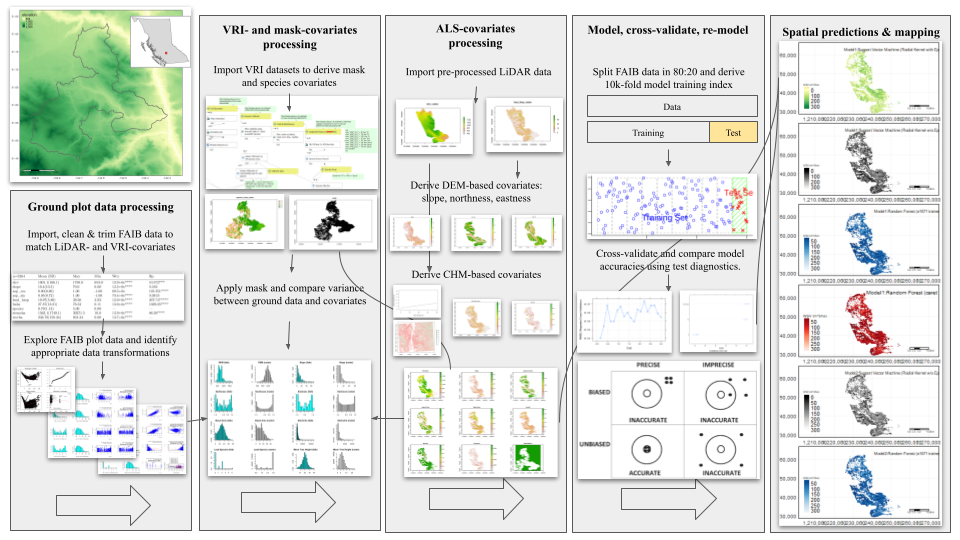

```{r setup, echo=FALSE, message=FALSE,warning=FALSE, error=FALSE}
library(sf)
library(sp)
library(terra)
library(raster)
library(dplyr)
library(caret)
library(caretEnsemble)
library(ForestTools)
library(lidR)
library(randomForest)
library(e1071)
library(rgdal)
library(rgeos)
library(Rcpp)
library(rmarkdown)
library(knitr)
library(MASS)
#devtools::install_github(("gearslaboratory/gdalUtils"))
library(gdalUtils)
library(gdalUtilities)
#webshot::install_phantomjs(force = TRUE)
#knit_hooks$set(webgl = hook_webgl)
#knit_hooks$set(rgl.static = hook_rgl)
knitr::opts_chunk$set(echo = TRUE, warning=FALSE, error=FALSE, message = FALSE)
set.seed(123)
```

## Action

The following markdown report provides a complete run-through and guide of a raster-to-raster workflow to generating Whole Stem Volume (m\^3/ha: WSVHA) raster estimates from initial phases of importing liDAR tiles, to deriving stem-detection map and a 95% canopy height model, to generating and masking DEM-based and species covariates, to fitting and training models with faib.csv data, to finally making spatial predictions using raster stack of covariates. The graphical abstract below is offered as reference guide.



## Import raster chunks

```{r, eval=FALSE}
zip_file_vh_quesnel = ("/media/seamus/128GB_WORKD/EFI-TCC/LiDAR_Data/quesnel_region/VegHt.zip")
zip_file_be_quesnel = ("/media/seamus/128GB_WORKD/EFI-TCC/LiDAR_Data/quesnel_region/BareEarth.zip")
zip_dir_vh_quesnel = ("/media/seamus/128GB_WORKD/EFI-TCC/LiDAR_Data/quesnel_region")
zip_dir_be_quesnel = ("/media/seamus/128GB_WORKD/EFI-TCC/LiDAR_Data/quesnel_region")
unzip(zip_file_vh_quesnel, exdir = zip_dir_vh_quesnel, overwrite = TRUE)
unzip(zip_file_be_quesnel, exdir=zip_dir_be_quesnel, overwrite = TRUE)
unzip_dir_vh_quesnel <- paste0("/media/seamus/128GB_WORKD/EFI-TCC/LiDAR_Data/quesnel_region/VegHt")
unzip_dir_be_quesnel <- paste0("/media/seamus128GB_WORKD/EFI-TCC/LiDAR_Data/quesnel_region/BareEarth")
zip_file_vh_gaspard = ("/media/seamus/128GB_WORKD/EFI-TCC/LiDAR_Data/gaspard_region/VegHt.zip")
zip_file_be_gaspard = ("/media/seamus/128GB_WORKD/EFI-TCC/LiDAR_Data/gaspard_region/BareEarth.zip")
zip_dir_vh_gaspard = ("/media/seamus/128GB_WORKD/EFI-TCC/LiDAR_Data/gaspard_region")
zip_dir_be_gaspard = ("/media/seamus/128GB_WORKD/EFI-TCC/LiDAR_Data/gaspard_region")
unzip(zip_file_vh_gaspard, exdir=zip_dir_vh_gaspard, overwrite = TRUE)
unzip(zip_file_be_gaspard, exdir=zip_dir_be_gaspard, overwrite = TRUE)
unzip_dir_vh_gaspard <- paste0("/media/seamus/128GB_WORKD/EFI-TCC/LiDAR_Data/gaspard_region/VegHt")
unzip_dir_be_gaspard <- paste0("/media/seamus/128GB_WORKD/EFI-TCC/LiDAR_Data/gaspard_region/BareEarth")
filez_vh_quesnel = list.files(unzip_dir_vh_quesnel, full.names = T, all.files = FALSE, pattern = '.tif$') 
filez_be_quesnel = list.files(unzip_dir_be_quesnel, full.names = T, all.files = FALSE, pattern = '.tif$') 
filez_vh_gaspard = list.files(unzip_dir_vh_gaspard, full.names = T, all.files = FALSE, pattern = '.tif$') 
filez_be_gaspard = list.files(unzip_dir_be_gaspard, full.names = T, all.files = FALSE, pattern = '.tif$') 
lead_htop_raster_list_quesnel <- lapply(filez_vh_quesnel, raster)
lead_htop_raster_list_gaspard <- lapply(filez_vh_gaspard, raster)
elev_raster_list_quesnel <- lapply(filez_be_quesnel, raster)
elev_raster_list_gaspard <- lapply(filez_be_gaspard, raster)
lead_htop_raster_quesnel = do.call(merge, c(lead_htop_raster_list_quesnel, tolerance = 1))
lead_htop_raster_gaspard = do.call(merge, c(lead_htop_raster_list_gaspard, tolerance = 1))
elev_raster_quesnel = do.call(merge, c(elev_raster_list_quesnel, tolerance = 1))
elev_raster_gaspard = do.call(merge, c(elev_raster_list_gaspard, tolerance = 1))

writeRaster(lead_htop_raster_quesnel, filename = "/media/seamus/128GB_WORKD/EFI-TCC/LiDAR_Data/quesnel_region/lead_htop_raster.tif", overwrite=TRUE)
writeRaster(lead_htop_raster_gaspard, filename = "/media/seamus/128GB_WORKD/EFI-TCC/LiDAR_Data/gaspard_region/lead_htop_raster.tif", overwrite=TRUE)
writeRaster(elev_raster_quesnel, filename = "/media/seamus/128GB_WORKD/EFI-TCC/LiDAR_Data/quesnel_region/elev_raster.tif", overwrite=TRUE)
writeRaster(elev_raster_gaspard, filename = "/media/seamus/128GB_WORKD/EFI-TCC/LiDAR_Data/gaspard_region/elev_raster.tif", overwrite=TRUE)
```

```{r, fig.show='hold', out.width="50%", echo=FALSE}
lead_htop_raster_quesnel = raster::raster("/media/seamus/128GB_WORKD/EFI-TCC/LiDAR_Data/quesnel_region/lead_htop_raster.tif")
lead_htop_raster_gaspard = raster::raster("/media/seamus/128GB_WORKD/EFI-TCC/LiDAR_Data/gaspard_region/lead_htop_raster.tif")
elev_raster_quesnel = raster::raster("/media/seamus/128GB_WORKD/EFI-TCC/LiDAR_Data/quesnel_region/elev_raster.tif")
elev_raster_gaspard = raster::raster("/media/seamus/128GB_WORKD/EFI-TCC/LiDAR_Data/gaspard_region/elev_raster.tif")
lead_htop_rast_quesnel = terra::rast(lead_htop_raster_quesnel)
lead_htop_rast_gaspard = terra::rast(lead_htop_raster_gaspard)
elev_rast_quesnel = terra::rast(elev_raster_quesnel)
elev_rast_gaspard = terra::rast(elev_raster_gaspard)
terra::plot(elev_rast_gaspard)
terra::plot(elev_rast_quesnel)
```

## Individual stem-detection: Variable window function

```{r, fig.show='hold', out.width="50%", rgl.static=TRUE, cache=TRUE}
kernel <- matrix(1,3,3)
wf_quan<-function(x){ 
  a=0.179-0.1
  b=0.51+0.5 
  y<-a*x+b 
  return(y)}
wf_plowright<-function(x){ 
  a=0.05
  b=0.6 
  y<-a*x+b 
  return(y)}
heights <- seq(0,40,0.5)
window_quan <- wf_quan(heights)
window_plowright <- wf_plowright(heights)
plot(heights, window_quan, type = "l",  ylim = c(0,12), xlab="point elevation (m)", ylab="window diameter (m)", main='Quan, 2022')
plot(heights, window_plowright, type = "l", ylim = c(0,12), xlab="point elevation (m)", ylab="window diameter (m)", main='Plowright, 2018')
```

## Individual stem-detection: Watershed \> 95% CHM

```{r, eval=FALSE}
lead_htop_raster_1m_smoothed_quesnel = focal(lead_htop_rast_quesnel, w = kernel, fun = median, na.rm = TRUE) %>% raster()
lead_htop_raster_1m_smoothed_gaspard = focal(lead_htop_rast_gaspard, w = kernel, fun = median, na.rm = TRUE) %>% raster()
ttops_2m_quan_quesnel <- ForestTools::vwf(lead_htop_raster_1m_smoothed_quesnel, wf_quan, 2)
ttops_2m_quan_gaspard = ForestTools::vwf(CHM = lead_htop_raster_1m_smoothed_gaspard, winFun = wf_quan, minHeight = 2)
ttops_2m_plowright_quesnel = ForestTools::vwf(CHM = lead_htop_raster_1m_smoothed_quesnel, winFun = wf_plowright, minHeight = 2)
ttops_2m_plowright_gaspard = ForestTools::vwf(CHM = lead_htop_raster_1m_smoothed_gaspard, winFun = wf_plowright, minHeight = 2)
writeOGR(ttops_2m_quan_quesnel, "/media/seamus/128GB_WORKD/data/vector/stem_maps", "treetops_quan_quesnel", driver = "ESRI Shapefile")
writeOGR(ttops_2m_quan_gaspard, "/media/seamus/128GB_WORKD/data/vector/stem_maps", "treetops_quan_gaspard", driver = "ESRI Shapefile")
writeOGR(ttops_2m_plowright_quesnel, "/media/seamus/128GB_WORKD/data/vector/stem_maps", "treetops_plowright_quesnel", driver = "ESRI Shapefile")
writeOGR(ttops_2m_plowright_gaspard, "/media/seamus/128GB_WORKD/data/vector/stem_maps", "treetops_plowright_gaspard", driver = "ESRI Shapefile")

quant95 <- function(x, ...) 
  quantile(x, c(0.95), na.rm = TRUE)
custFuns <- list(quant95, max)
names(custFuns) <- c("95thQuantile", "Max")

ttops_2m_quan_quesnel <- readOGR(dsn = "/media/seamus/128GB_WORKD/data/vector/stem_maps/treetops_quan_quesnel.shp", layer="treetops_quan_quesnel")
ttops_2m_quan_gaspard <- readOGR(dsn = "/media/seamus/128GB_WORKD/data/vector/stem_maps/treetops_quan_gaspard.shp", layer="treetops_quan_gaspard")
ttops_2m_Quan_raster_2m1.5m_95th_20cell_quesnel <- ForestTools::sp_summarise(ttops_2m_quan_quesnel, grid = 20, variables = "height", statFuns = custFuns)
ttops_2m_Quan_raster_2m1.5m_95th_20cell_gaspard <- ForestTools::sp_summarise(ttops_2m_quan_gaspard, grid = 20, variables = "height", statFuns = custFuns)
ttops_2m_Quan_raster_2m1.5m_95th_100cell_quesnel <- ForestTools::sp_summarise(ttops_2m_quan_quesnel, grid = 100, variables = "height", statFuns = custFuns)
ttops_2m_Quan_raster_2m1.5m_95th_100cell_gaspard <- ForestTools::sp_summarise(ttops_2m_quan_gaspard, grid = 100, variables = "height", statFuns = custFuns)
lead_htop_ttops_20cell_quesnel = ttops_2m_Quan_raster_2m1.5m_95th_20cell_quesnel[["height95thQuantile"]]
lead_htop_ttops_20cell_gaspard = ttops_2m_Quan_raster_2m1.5m_95th_20cell_gaspard[["height95thQuantile"]]
lead_htop_ttops_100cell_quesnel = ttops_2m_Quan_raster_2m1.5m_95th_100cell_quesnel[["height95thQuantile"]]
lead_htop_ttops_100cell_gaspard = ttops_2m_Quan_raster_2m1.5m_95th_100cell_gaspard[["height95thQuantile"]]
stemsha_L_ttops_20cell_quesnel = ttops_2m_Quan_raster_2m1.5m_95th_20cell_quesnel[["TreeCount"]]
stemsha_L_ttops_20cell_gaspard = ttops_2m_Quan_raster_2m1.5m_95th_20cell_gaspard[["TreeCount"]]
stemsha_L_ttops_100cell_quesnel = ttops_2m_Quan_raster_2m1.5m_95th_100cell_quesnel[["TreeCount"]]
stemsha_L_ttops_100cell_gaspard = ttops_2m_Quan_raster_2m1.5m_95th_100cell_gaspard[["TreeCount"]]
raster::writeRaster(lead_htop_ttops_20cell_quesnel, filename = "/media/seamus/128GB_WORKD/data/raster/tcc/lead_htop_95th/lead_htop_ttops_20cell_quesnel.tif", overwrite=TRUE)
raster::writeRaster(lead_htop_ttops_20cell_gaspard, filename = "/media/seamus/128GB_WORKD/data/raster/tcc/lead_htop_95th/lead_htop_ttops_20cell_gaspard.tif", overwrite=TRUE)
raster::writeRaster(lead_htop_ttops_100cell_quesnel, filename = "/media/seamus/128GB_WORKD/data/raster/tcc/lead_htop_95th/lead_htop_ttops_100cell_quesnel.tif", overwrite=TRUE)
raster::writeRaster(lead_htop_ttops_100cell_gaspard, filename = "/media/seamus/128GB_WORKD/data/raster/tcc/lead_htop_95th/lead_htop_ttops_100cell_gaspard.tif", overwrite=TRUE)
raster::writeRaster(stemsha_L_ttops_20cell_quesnel, filename = "/media/seamus/128GB_WORKD/data/raster/tcc/stemsha_L_95th/stemsha_L_ttops_20cell_quesnel.tif", overwrite=TRUE)
raster::writeRaster(stemsha_L_ttops_20cell_gaspard, filename = "/media/seamus/128GB_WORKD/data/raster/tcc/stemsha_L_95th/stemsha_L_ttops_20cell_gaspard.tif", overwrite=TRUE)
raster::writeRaster(stemsha_L_ttops_100cell_quesnel, filename = "/media/seamus/128GB_WORKD/data/raster/tcc/stemsha_L_95th/stemsha_L_ttops_100cell_quesnel.tif", overwrite=TRUE)
raster::writeRaster(stemsha_L_ttops_100cell_gaspard, filename = "/media/seamus/128GB_WORKD/data/raster/tcc/stemsha_L_95th/stemsha_L_ttops_100cell_gaspard.tif", overwrite=TRUE)
```

## Import species layers: VRI rasterization

```{r, eval=FALSE}
lead_htop_rast_20cell_quesnel = terra::rast("/media/seamus/128GB_WORKD/data/raster/tcc/lead_htop_95th/lead_htop_ttops_20cell_quesnel.tif")
lead_htop_rast_20cell_gaspard = terra::rast("/media/seamus/128GB_WORKD/data/raster/tcc/lead_htop_95th/lead_htop_ttops_20cell_gaspard.tif")
stemsha_L_rast_20cell_quesnel = terra::rast("/media/seamus/128GB_WORKD/data/raster/tcc/stemsha_L_95th/stemsha_L_ttops_20cell_quesnel.tif")
stemsha_L_rast_20cell_gaspard = terra::rast("/media/seamus/128GB_WORKD/data/raster/tcc/stemsha_L_95th/stemsha_L_ttops_20cell_gaspard.tif")
crs(lead_htop_rast_20cell_quesnel) = "epsg:3005"
crs(lead_htop_rast_20cell_gaspard) = "epsg:3005"
lead_htop_sv_20cell_quesnel = as.polygons(lead_htop_rast_20cell_quesnel)
lead_htop_sv_20cell_gaspard = as.polygons(lead_htop_rast_20cell_gaspard)
lead_htop_sf_20cell_quesnel = sf::st_as_sf(lead_htop_sv_20cell_quesnel)
lead_htop_sf_20cell_gaspard = sf::st_as_sf(lead_htop_sv_20cell_gaspard)

vri_sf = read_sf("/media/seamus/128GB_WORKD/data/vector/vri/vri_bc_2020_rank1.shp")
vri_species = vri_sf[c("SPECIES__1", "SPECIES_CD", "SPECIES_PC")]
vri_species_aoi =  dplyr::filter(vri_species, SPECIES__1=='PL' | SPECIES__1=='PLI' | SPECIES__1=='FD' | SPECIES__1=='FDI' | SPECIES__1=='SB' | SPECIES__1=='SE' | SPECIES__1=='SW' | SPECIES__1=='SX' | SPECIES__1=='CW' | SPECIES__1=='HW' | SPECIES__1=='BL' | SPECIES__1=='LW')
vri_species_aoi = vri_species_aoi[!(vri_species_aoi$SPECIES__1 == 'FD' & vri_species_aoi$SPECIES_PC >= 50 | vri_species_aoi$SPECIES__1 == 'FDI' & vri_species_aoi$SPECIES_PC >=50),]
vri_species_aoi$SPECIES__1 = dplyr::recode(vri_species_aoi$SPECIES__1, PL = 0, PLI = 0, SB = 1, SE = 1, SW = 1, SX = 1, FD = 2, FDI = 2, CW = 3, HW = 4, BL = 5, LW = 6)
vri_species_aoi = dplyr::rename(vri_species_aoi, species_class = SPECIES__1)
vri_species_aoi = vri_species_aoi["species_class"]
vri_species_aoi_sf = sf::st_as_sf(vri_species_aoi)
vri_species_aoi_quesnel = st_intersection(vri_species_aoi_sf, st_make_valid(lead_htop_sf_20cell_quesnel))
vri_species_aoi_gaspard = st_intersection(vri_species_aoi_sf, st_make_valid(lead_htop_sf_20cell_gaspard))
species_class_rast_quesnel = terra::rasterize(vect(vri_species_aoi_quesnel), lead_htop_rast_20cell_quesnel, field = "species_class", touches = TRUE)
species_class_rast_gaspard = terra::rasterize(vect(vri_species_aoi_gaspard), lead_htop_rast_20cell_gaspard, field = "species_class", touches = TRUE)
species_class_raster_quesnel = raster::raster(species_class_rast_quesnel)
species_class_raster_gaspard = raster::raster(species_class_rast_gaspard)
raster::writeRaster(species_class_raster_quesnel, filename = "/media/seamus/128GB_WORKD/data/raster/tcc/species/species_class_raster_quesnel.tif", overwrite=TRUE)
raster::writeRaster(species_class_raster_gaspard, filename = "/media/seamus/128GB_WORKD/data/raster/tcc/species/species_class_raster_gaspard.tif", overwrite=TRUE)
```

## Derive DEM-based terrain rasters

```{r, eval=FALSE}
terra::crs(elev_rast_quesnel) = "epsg:3005"
terra::crs(elev_rast_gaspard) = "epsg:3005"
elev_rast_quesnel = terra::aggregate(elev_rast_quesnel, fact = 20, fun = mean)
elev_rast_gaspard = terra::aggregate(elev_rast_gaspard, fact = 20, fun = mean)
slope_rast_quesnel = terra::terrain(elev_rast_quesnel, v="slope", unit="degrees", neighbors=8)
slope_rast_gaspard = terra::terrain(elev_rast_gaspard, v="slope", unit="degrees", neighbors=8)
aspect_rast_quesnel = terra::terrain(elev_rast_quesnel, v="aspect", unit="degrees", neighbors=8)
aspect_rast_gaspard = terra::terrain(elev_rast_gaspard, v="aspect", unit="degrees", neighbors=8)
asp_cos_rast_quesnel = cos((aspect_rast_quesnel*pi)/180)
asp_cos_rast_gaspard = cos((aspect_rast_gaspard*pi)/180)
asp_sin_rast_quesnel = sin((aspect_rast_quesnel*pi)/180)
asp_sin_rast_gaspard = sin((aspect_rast_gaspard*pi)/180)

lead_htop_rast_20cell_quesnel = terra::resample(lead_htop_rast_20cell_quesnel, elev_rast_quesnel)
lead_htop_rast_20cell_gaspard = terra::resample(lead_htop_rast_20cell_gaspard, elev_rast_gaspard)
stemsha_L_rast_20cell_quesnel = terra::resample(stemsha_L_rast_20cell_quesnel, elev_rast_quesnel)
stemsha_L_rast_20cell_gaspard = terra::resample(stemsha_L_rast_20cell_gaspard, elev_rast_gaspard)
species_class_rast_quesnel = terra::resample(species_class_rast_quesnel, elev_rast_quesnel)
species_class_rast_gaspard = terra::resample(species_class_rast_gaspard, elev_rast_gaspard)
elev_rast_quesnel = terra::mask(elev_rast_quesnel, lead_htop_rast_20cell_quesnel)
elev_rast_gaspard = terra::mask(elev_rast_gaspard, lead_htop_rast_20cell_gaspard)
slope_rast_quesnel = terra::mask(slope_rast_quesnel, lead_htop_rast_20cell_quesnel)
slope_rast_gaspard = terra::mask(slope_rast_gaspard, lead_htop_rast_20cell_gaspard)
asp_cos_rast_quesnel = terra::mask(asp_cos_rast_quesnel, lead_htop_rast_20cell_quesnel)
asp_cos_rast_gaspard = terra::mask(asp_cos_rast_gaspard, lead_htop_rast_20cell_gaspard)
asp_sin_rast_quesnel = terra::mask(asp_sin_rast_quesnel, lead_htop_rast_20cell_quesnel)
asp_sin_rast_gaspard = terra::mask(asp_sin_rast_gaspard, lead_htop_rast_20cell_gaspard)
species_class_rast_quesnel = terra::mask(species_class_rast_quesnel, lead_htop_rast_20cell_quesnel)
species_class_rast_gaspard = terra::mask(species_class_rast_gaspard, lead_htop_rast_20cell_gaspard)

writeRaster(elev_rast_quesnel, filename = "/media/seamus/128GB_WORKD/data/raster/tcc/elevation/elev_raster_quesnel.tif", overwrite=TRUE)
writeRaster(elev_rast_gaspard, filename = "/media/seamus/128GB_WORKD/data/raster/tcc/elevation/elev_raster_gaspard.tif", overwrite=TRUE)
writeRaster(slope_rast_quesnel, filename = "/media/seamus/128GB_WORKD/data/raster/tcc/slope/slope_raster_quesnel.tif", overwrite=TRUE)
writeRaster(slope_rast_gaspard, filename = "/media/seamus/128GB_WORKD/data/raster/tcc/slope/slope_raster_gaspard.tif", overwrite=TRUE)
writeRaster(asp_cos_rast_quesnel, filename = "/media/seamus/128GB_WORKD/data/raster/tcc/aspect/asp_cos_raster_quesnel.tif", overwrite=TRUE)
writeRaster(asp_cos_rast_gaspard, filename = "/media/seamus/128GB_WORKD/data/raster/tcc/aspect/asp_cos_raster_gaspard.tif", overwrite=TRUE)
writeRaster(asp_sin_rast_quesnel, filename = "/media/seamus/128GB_WORKD/data/raster/tcc/aspect/asp_sin_raster_quesnel.tif", overwrite=TRUE)
writeRaster(asp_sin_rast_gaspard, filename = "/media/seamus/128GB_WORKD/data/raster/tcc/aspect/asp_sin_raster_gaspard.tif", overwrite=TRUE)
writeRaster(species_class_rast_quesnel, filename = "/media/seamus/128GB_WORKD/data/raster/tcc/species/species_class_raster_quesnel.tif", overwrite=TRUE)
writeRaster(species_class_rast_gaspard, filename = "/media/seamus/128GB_WORKD/data/raster/tcc/species/species_class_raster_gaspard.tif", overwrite=TRUE)
```

## Import approved mask layers

```{r, eval=FALSE}
mask_burn2017 = sf::read_sf("/media/seamus/128GB_WORKD/data/vector/tcc_mask_layers/TCC_Burn_Severity TCC_Burn_Severity_2017.shp")
mask_burn2018 = sf::read_sf("/media/seamus/128GB_WORKD/data/vector/tcc_mask_layers/TCC_Burn_Severity TCC_Burn_Severity_2018.shp")
mask_burn2021 = sf::read_sf("/media/seamus/128GB_WORKD/data/vector/tcc_mask_layers/TCC_Burn_Severity TCC_Burn_Severity_2021.shp")
mask_burn2017 = mask_burn2017["BurnSev"]
mask_burn2018 = mask_burn2018["BurnSev"]
mask_burn2021 = mask_burn2021["BurnSev"]
mask_burn2017 = dplyr::filter(mask_burn2017, BurnSev == 'High')
mask_burn2018 = dplyr::filter(mask_burn2018, BurnSev == 'High')
mask_burn2021 = dplyr::filter(mask_burn2021, BurnSev == 'High')
mask_burn2017_quesnel = sf::st_intersection(sf::st_make_valid(mask_burn2017), lead_htop_sf_20cell_quesnel)
mask_burn2017_gaspard = sf::st_intersection(sf::st_make_valid(mask_burn2017), lead_htop_sf_20cell_gaspard)
mask_burn2018_quesnel = sf::st_intersection(sf::st_make_valid(mask_burn2018), lead_htop_sf_20cell_quesnel)
mask_burn2018_gaspard = sf::st_intersection(sf::st_make_valid(mask_burn2018), lead_htop_sf_20cell_gaspard)
mask_burn2021_quesnel = sf::st_intersection(sf::st_make_valid(mask_burn2021), lead_htop_sf_20cell_quesnel)
mask_burn2021_gaspard = sf::st_intersection(sf::st_make_valid(mask_burn2021), lead_htop_sf_20cell_gaspard)
masks_df_quesnel = full_join(as_tibble(mask_burn2017_quesnel), as_tibble(mask_burn2018_quesnel), as_tibble(mask_burn2021_quesnel), by = "geometry")
masks_df_gaspard = full_join(as_tibble(mask_burn2017_gaspard), as_tibble(mask_burn2018_gaspard), as_tibble(mask_burn2021_gaspard), by = "geometry")
masks_sf_quesnel = st_as_sf(masks_df_quesnel) # easier to combine by 'geometry'
masks_sf_gaspard = st_as_sf(masks_df_gaspard) # easier to combine by 'geometry'

mask_clearcut = sf::read_sf("/media/seamus/128GB_WORKD/data/vector/tcc_mask_layers/RSLT_CCRES_CLEAR.shp")
mask_clearcut_quesnel = sf::st_intersection(mask_clearcut, st_make_valid(lead_htop_sf_20cell_quesnel))
mask_clearcut_gaspard = sf::st_intersection(mask_clearcut, st_make_valid(lead_htop_sf_20cell_gaspard))
masks_df_quesnel = full_join(as_tibble(masks_sf_quesnel), as_tibble(mask_clearcut_quesnel), by = 'geometry')
masks_df_gaspard = full_join(as_tibble(masks_sf_gaspard), as_tibble(mask_clearcut_gaspard), by = 'geometry')
masks_sf_quesnel = st_as_sf(masks_df_quesnel)
masks_sf_gaspard = st_as_sf(masks_df_gaspard)

mask_blocks = sf::read_sf("/media/seamus/128GB_WORKD/data/vector/tcc_mask_layers/TCC_Blocks_Join.shp")
mask_blocks_quesnel = sf::st_intersection(mask_blocks, st_make_valid(lead_htop_sf_20cell_quesnel))
mask_blocks_gaspard = sf::st_intersection(mask_blocks, st_make_valid(lead_htop_sf_20cell_gaspard))
masks_df_quesnel = full_join(as_tibble(masks_sf_quesnel), as_tibble(mask_blocks_quesnel), by = 'geometry')
masks_df_gaspard = full_join(as_tibble(masks_sf_gaspard), as_tibble(mask_blocks_gaspard), by = 'geometry')
masks_sf_quesnel = st_as_sf(masks_df_quesnel)
masks_sf_gaspard = st_as_sf(masks_df_gaspard)

mask_roads_tcc = sf::read_sf("/media/seamus/128GB_WORKD/data/vector/tcc_mask_layers/TCC_Roads.shp")
mask_roads_tcc = sf::st_zm(mask_roads_tcc)
mask_roads_tcc_quesnel = sf::st_intersection(mask_roads_tcc, st_make_valid(lead_htop_sf_20cell_quesnel))
mask_roads_tcc_gaspard = sf::st_intersection(mask_roads_tcc, st_make_valid(lead_htop_sf_20cell_gaspard))
mask_roads_tcc_quesnel = sf::st_buffer(mask_roads_tcc_quesnel, dist = 15, nQuadSegs = 5, endCapStyle = "ROUND", joinStyle = "ROUND", mitreLimit = 2)
mask_roads_tcc_gaspard = sf::st_buffer(mask_roads_tcc_gaspard, dist = 15, nQuadSegs = 5, endCapStyle = "ROUND", joinStyle = "ROUND", mitreLimit = 2)

mask_roads_ften = sf::read_sf("/media/seamus/128GB_WORKD/data/vector/tcc_mask_layers/FTEN_Roads_All.shp")
mask_roads_ften = sf::st_zm(mask_roads_ften)
mask_roads_ften_quesnel = sf::st_intersection(mask_roads_ften, st_make_valid(lead_htop_sf_20cell_quesnel))
mask_roads_ften_gaspard = sf::st_intersection(mask_roads_ften, st_make_valid(lead_htop_sf_20cell_gaspard))
mask_roads_ften_quesnel = sf::st_buffer(mask_roads_ften_quesnel, dist = 15, nQuadSegs = 5, endCapStyle = "ROUND", joinStyle = "ROUND", mitreLimit = 2)
mask_roads_ften_gaspard = sf::st_buffer(mask_roads_ften_gaspard, dist = 15, nQuadSegs = 5, endCapStyle = "ROUND", joinStyle = "ROUND", mitreLimit = 2)
masks_df_quesnel = full_join(as_tibble(masks_sf_quesnel), as_tibble(mask_roads_tcc_quesnel), as_tibble(mask_roads_ften_quesnel), by = 'geometry')
masks_df_gaspard = full_join(as_tibble(masks_sf_gaspard), as_tibble(mask_roads_tcc_gaspard), as_tibble(mask_roads_ften_gaspard), by = 'geometry')
masks_sf_quesnel = st_as_sf(masks_df_quesnel)
masks_sf_gaspard = st_as_sf(masks_df_gaspard)
masks_rast_quesnel = rasterize(vect(masks_sf_quesnel), lead_htop_rast_20cell_quesnel, touches = TRUE)
masks_rast_gaspard = rasterize(vect(masks_sf_gaspard), lead_htop_rast_20cell_gaspard, touches = TRUE)
masks_raster_quesnel = raster::raster(masks_rast_quesnel)
masks_raster_gaspard = raster::raster(masks_rast_gaspard)
writeRaster(masks_raster_quesnel, filename = "/media/seamus/128GB_WORKD/data/vector/tcc_mask_layers/mask_raster_quesnel.tif", overwrite=TRUE)
writeRaster(masks_raster_gaspard, filename = "/media/seamus/128GB_WORKD/data/vector/tcc_mask_layers/mask_raster_gaspard.tif", overwrite=TRUE)
```

```{r, fig.show='hold', out.width="50%", echo=FALSE}
masks_raster_quesnel = terra::rast("/media/seamus/128GB_WORKD/data/raster/tcc//mask/mask_raster_quesnel.tif")
masks_raster_gaspard = terra::rast("/media/seamus/128GB_WORKD/data/raster/tcc/mask/mask_raster_gaspard.tif")
masks_sv_quesnel = as.polygons(masks_raster_quesnel)
masks_sv_gaspard = as.polygons(masks_raster_gaspard)
masks_sf_quesnel = sf::st_as_sf(masks_sv_quesnel)
masks_sf_gaspard = sf::st_as_sf(masks_sv_gaspard)
ggplot(masks_sf_gaspard) + geom_sf(aes(fill = 'red'), show.legend = FALSE)
ggplot(masks_sf_quesnel) + geom_sf(aes(fill = 'red'), show.legend = FALSE)
```

## Apply mask and prepare covariate stacks

```{r, eval=FALSE}
masks_rast_quesnel = terra::resample(masks_rast_quesnel, lead_htop_rast_20cell_quesnel, method="near")
masks_rast_gaspard = terra::resample(masks_rast_gaspard, lead_htop_rast_20cell_gaspard, method="near")
lead_htop_rast_20cell_quesnel = mask(lead_htop_rast_20cell_quesnel, masks_rast_quesnel, inverse=TRUE)
lead_htop_rast_20cell_gaspard = mask(lead_htop_rast_20cell_gaspard, masks_rast_gaspard, inverse=TRUE)
elev_rast_quesnel = mask(elev_rast_quesnel, masks_rast_quesnel, inverse=TRUE)
elev_rast_gaspard = mask(elev_rast_gaspard, masks_rast_gaspard, inverse=TRUE)
slope_rast_quesnel = mask(slope_rast_quesnel, masks_rast_quesnel, inverse=TRUE)
slope_rast_gaspard = mask(slope_rast_gaspard, masks_rast_gaspard, inverse=TRUE)
asp_cos_rast_quesnel = mask(asp_cos_rast_quesnel, masks_rast_quesnel, inverse=TRUE)
asp_cos_rast_gaspard = mask(asp_cos_rast_gaspard, masks_rast_gaspard, inverse=TRUE)
asp_sin_rast_quesnel = mask(asp_sin_rast_quesnel, masks_rast_quesnel, inverse=TRUE)
asp_sin_rast_gaspard = mask(asp_sin_rast_gaspard, masks_rast_gaspard, inverse=TRUE)
stemsha_L_rast_20cell_quesnel = mask(stemsha_L_rast_20cell_quesnel, masks_rast_quesnel, inverse=TRUE)
stemsha_L_rast_20cell_gaspard = mask(stemsha_L_rast_20cell_gaspard, masks_rast_gaspard, inverse=TRUE)
species_class_rast_quesnel = mask(species_class_rast_quesnel, masks_rast_quesnel, inverse=TRUE)
species_class_rast_gaspard = mask(species_class_rast_gaspard, masks_rast_gaspard, inverse=TRUE)

writeRaster(elev_rast_quesnel, filename = "/media/seamus/128GB_WORKD/data/raster/tcc/masked-covariates/elev_raster_20cell_quesnel.tif", overwrite=TRUE)
writeRaster(elev_rast_gaspard, filename = "/media/seamus/128GB_WORKD/data/raster/tcc/masked-covariates/elev_raster_20cell_gaspard.tif", overwrite=TRUE)
writeRaster(slope_rast_quesnel, filename = "/media/seamus/128GB_WORKD/data/raster/tcc/masked-covariates/slope_raster_20cell_quesnel.tif", overwrite=TRUE)
writeRaster(slope_rast_gaspard, filename = "/media/seamus/128GB_WORKD/data/raster/tcc/masked-covariates/slope_raster_20cell_gaspard.tif", overwrite=TRUE)
writeRaster(asp_cos_rast_quesnel, filename = "/media/seamus/128GB_WORKD/data/raster/tcc/masked-covariates/asp_cos_raster_20cell_quesnel.tif", overwrite=TRUE)
writeRaster(asp_cos_rast_gaspard, filename = "/media/seamus/128GB_WORKD/data/raster/tcc/masked-covariates/asp_cos_raster_20cell_gaspard.tif", overwrite=TRUE)
writeRaster(asp_sin_rast_quesnel, filename = "/media/seamus/128GB_WORKD/data/raster/tcc/masked-covariates/asp_sin_raster_20cell_quesnel.tif", overwrite=TRUE)
writeRaster(asp_sin_rast_gaspard, filename = "/media/seamus/128GB_WORKD/data/raster/tcc/masked-covariates/asp_sin_raster_20cell_gaspard.tif", overwrite=TRUE)
writeRaster(species_class_rast_quesnel, filename = "/media/seamus/128GB_WORKD/data/raster/tcc/masked-covariates/species_class_raster_20cell_quesnel.tif", overwrite=TRUE)
writeRaster(species_class_rast_gaspard, filename = "/media/seamus/128GB_WORKD/data/raster/tcc/masked-covariates/species_class_raster_20cell_gaspard.tif", overwrite=TRUE)
writeRaster(stemsha_L_rast_20cell_quesnel, filename = "/media/seamus/128GB_WORKD/data/raster/tcc/masked-covariates/stemsha_L_rast_20cell_quesnel.tif", overwrite=TRUE)
writeRaster(stemsha_L_rast_20cell_gaspard, filename = "/media/seamus/128GB_WORKD/data/raster/tcc/masked-covariates/stemsha_L_rast_20cell_gaspard.tif", overwrite=TRUE)
writeRaster(lead_htop_rast_20cell_quesnel, filename = "/media/seamus/128GB_WORKD/data/raster/tcc/masked-covariates/lead_htop_rast_20cell_quesnel.tif", overwrite=TRUE)
writeRaster(lead_htop_rast_20cell_gaspard, filename = "/media/seamus/128GB_WORKD/data/raster/tcc/masked-covariates/lead_htop_rast_20cell_gaspard.tif", overwrite=TRUE)

elev_raster_quesnel = raster::raster(elev_rast_quesnel)
slope_raster_quesnel = raster::raster(slope_rast_quesnel)
asp_cos_raster_quesnel = raster::raster(asp_cos_rast_quesnel)
asp_sin_raster_quesnel = raster::raster(asp_sin_rast_quesnel)
species_class_raster_quesnel = raster::raster(species_class_rast_quesnel)
stemsha_L_raster_quesnel = raster::raster(stemsha_L_rast_20cell_quesnel)
lead_htop_raster_quesnel = raster::raster(lead_htop_rast_20cell_quesnel)

elev_raster_gaspard = raster::raster(elev_rast_gaspard)
slope_raster_gaspard = raster::raster(slope_rast_gaspard)
asp_cos_raster_gaspard = raster::raster(asp_cos_rast_gaspard)
asp_sin_raster_gaspard = raster::raster(asp_sin_rast_gaspard)
species_class_raster_gaspard = raster::raster(species_class_rast_gaspard)
stemsha_L_raster_gaspard = raster::raster(stemsha_L_rast_20cell_gaspard)
lead_htop_raster_gaspard = raster::raster(lead_htop_rast_20cell_gaspard)

elev_raster_list = list(elev_raster_quesnel, elev_raster_gaspard)
slope_raster_list = list(slope_raster_quesnel, slope_raster_gaspard)
asp_cos_raster_list = list(asp_cos_raster_quesnel, asp_cos_raster_gaspard)
asp_sin_raster_list = list(asp_sin_raster_quesnel, asp_sin_raster_gaspard)
species_class_raster_list = list(species_class_raster_quesnel, species_class_raster_gaspard)
stemsha_L_raster_list = list(stemsha_L_raster_quesnel, stemsha_L_raster_gaspard)
lead_htop_raster_list = list(lead_htop_raster_quesnel, lead_htop_raster_gaspard)

elev_raster = do.call(merge, c(elev_raster_list, tolerance = 1))
slope_raster = do.call(merge, c(slope_raster_list, tolerance = 1))
asp_cos_raster = do.call(merge, c(asp_cos_raster_list, tolerance = 1))
asp_sin_raster = do.call(merge, c(asp_sin_raster_list, tolerance = 1))
species_class_raster = do.call(merge, c(species_class_raster_list, tolerance = 1))
stemsha_L_raster = do.call(merge, c(stemsha_L_raster_list, tolerance = 1))
lead_htop_raster = do.call(merge, c(lead_htop_raster_list, tolerance = 1))

writeRaster(elev_raster, filename = "/media/seamus/128GB_WORKD/data/raster/tcc/masked-covariates/elev_raster_20cell_allSites.tif", overwrite=TRUE)
writeRaster(slope_raster, filename = "/media/seamus/128GB_WORKD/data/raster/tcc/masked-covariates/slope_raster_20cell_allSites.tif", overwrite=TRUE)
writeRaster(asp_cos_raster, filename = "/media/seamus/128GB_WORKD/data/raster/tcc/masked-covariates/asp_cos_raster_20cell_allSites.tif", overwrite=TRUE)
writeRaster(asp_sin_raster, filename = "/media/seamus/128GB_WORKD/data/raster/tcc/masked-covariates/asp_sin_raster_20cell_allSites.tif", overwrite=TRUE)
writeRaster(species_class_raster, filename = "/media/seamus/128GB_WORKD/data/raster/tcc/masked-covariates/species_class_raster_20cell_allSites.tif", overwrite=TRUE)
writeRaster(stemsha_L_raster, filename = "/media/seamus/128GB_WORKD/data/raster/tcc/masked-covariates/stemsha_L_raster_20cell_allSites.tif", overwrite=TRUE)
writeRaster(lead_htop_raster, filename = "/media/seamus/128GB_WORKD/data/raster/tcc/masked-covariates/lead_htop_raster_20cell_allSites.tif", overwrite=TRUE)

covs_m1_quesnel = raster::stack(
  elev_raster_quesnel, 
  slope_raster_quesnel,
  #aspect_raster_quesnel,
  asp_cos_raster_quesnel,
  asp_sin_raster_quesnel,
  species_class_raster_quesnel,
  lead_htop_raster_quesnel,
  stemsha_L_raster_quesnel)

covs_m1_gaspard = raster::stack(
  elev_raster_gaspard, 
  slope_raster_gaspard,
  #aspect_raster_gaspard,
  asp_cos_raster_gaspard,
  asp_sin_raster_gaspard,
  species_class_raster_gaspard,
  lead_htop_raster_gaspard,
  stemsha_L_raster_gaspard)

covs_m2_quesnel = raster::stack(
  elev_raster_quesnel, 
  slope_raster_quesnel,
  #aspect_raster_quesnel,
  asp_cos_raster_quesnel,
  asp_sin_raster_quesnel,
  species_class_raster_quesnel,
  lead_htop_raster_quesnel)

covs_m2_gaspard = raster::stack(
  elev_raster_gaspard, 
  slope_raster_gaspard,
  #aspect_raster_gaspard,
  asp_cos_raster_gaspard,
  asp_sin_raster_gaspard,
  species_class_raster_gaspard,
  lead_htop_raster_gaspard)

covs_m2 = raster::stack(
  elev_raster, 
  slope_raster,
  #aspect_raster, 
  asp_cos_raster,
  asp_sin_raster,
  lead_htop_raster,
  species_class_raster)

covs_m1 = raster::stack(
  elev_raster, 
  slope_raster,
  #aspect_raster, 
  asp_cos_raster,
  asp_sin_raster,
  lead_htop_raster,
  species_class_raster,
  stemsha_L_raster)
```

```{r, echo=FALSE}
elev_raster_quesnel = raster::raster("/media/seamus/128GB_WORKD/data/raster/tcc/masked-covariates/elev_raster_20cell_quesnel.tif")
slope_raster_quesnel = raster::raster("/media/seamus/128GB_WORKD/data/raster/tcc/masked-covariates/slope_raster_20cell_quesnel.tif")
asp_cos_raster_quesnel = raster::raster("/media/seamus/128GB_WORKD/data/raster/tcc/masked-covariates/asp_cos_raster_20cell_quesnel.tif")
asp_sin_raster_quesnel = raster::raster("/media/seamus/128GB_WORKD/data/raster/tcc/masked-covariates/asp_sin_raster_20cell_quesnel.tif")
species_class_raster_quesnel = raster::raster("/media/seamus/128GB_WORKD/data/raster/tcc/masked-covariates/species_class_raster_20cell_quesnel.tif")
stemsha_L_raster_quesnel = raster::raster("/media/seamus/128GB_WORKD/data/raster/tcc/masked-covariates/stemsha_L_raster_20cell_quesnel.tif")
lead_htop_raster_quesnel = raster::raster("/media/seamus/128GB_WORKD/data/raster/tcc/masked-covariates/lead_htop_raster_20cell_quesnel.tif")

elev_raster_gaspard = raster::raster("/media/seamus/128GB_WORKD/data/raster/tcc/masked-covariates/elev_raster_20cell_gaspard.tif")
slope_raster_gaspard = raster::raster("/media/seamus/128GB_WORKD/data/raster/tcc/masked-covariates/slope_raster_20cell_gaspard.tif")
asp_cos_raster_gaspard = raster::raster("/media/seamus/128GB_WORKD/data/raster/tcc/masked-covariates/asp_cos_raster_20cell_gaspard.tif")
asp_sin_raster_gaspard = raster::raster("/media/seamus/128GB_WORKD/data/raster/tcc/masked-covariates/asp_sin_raster_20cell_gaspard.tif")
species_class_raster_gaspard = raster::raster("/media/seamus/128GB_WORKD/data/raster/tcc/masked-covariates/species_class_raster_20cell_gaspard.tif")
stemsha_L_raster_gaspard = raster::raster("/media/seamus/128GB_WORKD/data/raster/tcc/masked-covariates/stemsha_L_raster_20cell_gaspard.tif")
lead_htop_raster_gaspard = raster::raster("/media/seamus/128GB_WORKD/data/raster/tcc/masked-covariates/lead_htop_raster_20cell_gaspard.tif")

elev_raster = raster::raster("/media/seamus/128GB_WORKD/data/raster/tcc/masked-covariates/elev_raster_20cell_allSites.tif")
slope_raster = raster::raster("/media/seamus/128GB_WORKD/data/raster/tcc/masked-covariates/slope_raster_20cell_allSites.tif")
asp_cos_raster = raster::raster("/media/seamus/128GB_WORKD/data/raster/tcc/masked-covariates/asp_cos_raster_20cell_allSites.tif")
asp_sin_raster = raster::raster("/media/seamus/128GB_WORKD/data/raster/tcc/masked-covariates/asp_sin_raster_20cell_allSites.tif")
species_class_raster = raster::raster("/media/seamus/128GB_WORKD/data/raster/tcc/masked-covariates/species_class_raster_20cell_allSites.tif")
stemsha_L_raster = raster::raster("/media/seamus/128GB_WORKD/data/raster/tcc/masked-covariates/stemsha_L_raster_20cell_allSites.tif")
lead_htop_raster = raster::raster("/media/seamus/128GB_WORKD/data/raster/tcc/masked-covariates/lead_htop_raster_20cell_allSites.tif")

elev_rast_gaspard = terra::rast(elev_raster_gaspard)
slope_rast_gaspard = terra::rast(slope_raster_gaspard)
asp_cos_rast_gaspard = terra::rast(asp_cos_raster_gaspard)
asp_sin_rast_gaspard = terra::rast(asp_sin_raster_gaspard)
species_class_rast_gaspard = terra::rast(species_class_raster_gaspard)
stemsha_L_rast_gaspard = terra::rast(stemsha_L_raster_gaspard)
lead_htop_rast_gaspard = terra::rast(lead_htop_raster_gaspard)

elev_rast_quesnel = terra::rast(elev_raster_quesnel)
slope_rast_quesnel = terra::rast(slope_raster_quesnel)
asp_cos_rast_quesnel = terra::rast(asp_cos_raster_quesnel)
asp_sin_rast_quesnel = terra::rast(asp_sin_raster_quesnel)
species_class_rast_quesnel = terra::rast(species_class_raster_quesnel)
stemsha_L_rast_quesnel = terra::rast(stemsha_L_raster_quesnel)
lead_htop_rast_quesnel = terra::rast(lead_htop_raster_quesnel)

elev_rast = terra::rast(elev_raster)
slope_rast = terra::rast(slope_raster)
asp_cos_rast = terra::rast(asp_cos_raster)
asp_sin_rast = terra::rast(asp_sin_raster)
species_class_rast = terra::rast(species_class_raster)
stemsha_L_rast = terra::rast(stemsha_L_raster)
lead_htop_rast = terra::rast(lead_htop_raster)

elev_rast = terra::rast(elev_raster)
slope_rast = terra::rast(slope_raster)
asp_cos_rast = terra::rast(asp_cos_raster)
asp_sin_rast = terra::rast(asp_sin_raster)
species_class_rast = terra::rast(species_class_raster)
stemsha_L_rast = terra::rast(stemsha_L_raster)
lead_htop_rast = terra::rast(lead_htop_raster)

lead_htop_rast_quesnel = terra::resample(lead_htop_rast_quesnel, elev_rast_quesnel)
lead_htop_rast_gaspard = terra::resample(lead_htop_rast_gaspard, elev_rast_gaspard)
lead_htop_rast = terra::resample(lead_htop_rast, elev_rast)
stemsha_L_rast_quesnel = terra::resample(stemsha_L_rast_quesnel, elev_rast_quesnel)
stemsha_L_rast_gaspard = terra::resample(stemsha_L_rast_gaspard, elev_rast_gaspard)
stemsha_L_rast = terra::resample(stemsha_L_rast, elev_rast)
species_class_rast_quesnel = terra::resample(species_class_rast_quesnel, elev_rast_quesnel)
species_class_rast_gaspard = terra::resample(species_class_rast_gaspard, elev_rast_gaspard)
species_class = terra::resample(species_class_rast, elev_rast)
elev_rast_quesnel = terra::mask(elev_rast_quesnel, lead_htop_rast_quesnel)
elev_rast_gaspard = terra::mask(elev_rast_gaspard, lead_htop_rast_gaspard)
elev_rast = terra::mask(elev_rast, lead_htop_rast)
slope_rast_quesnel = terra::mask(slope_rast_quesnel, lead_htop_rast_quesnel)
slope_rast_gaspard = terra::mask(slope_rast_gaspard, lead_htop_rast_gaspard)
slope_rast = terra::mask(slope_rast, lead_htop_rast)
asp_cos_rast_quesnel = terra::mask(asp_cos_rast_quesnel, lead_htop_rast_quesnel)
asp_cos_rast_gaspard = terra::mask(asp_cos_rast_gaspard, lead_htop_rast_gaspard)
asp_cos_rast = terra::mask(asp_cos_rast, lead_htop_rast)
asp_sin_rast_quesnel = terra::mask(asp_sin_rast_quesnel, lead_htop_rast_quesnel)
asp_sin_rast_gaspard = terra::mask(asp_sin_rast_gaspard, lead_htop_rast_gaspard)
asp_sin_rast = terra::mask(asp_sin_rast, lead_htop_rast)
species_class_rast_quesnel = terra::mask(species_class_rast_quesnel, lead_htop_rast_quesnel)
species_class_rast_gaspard = terra::mask(species_class_rast_gaspard, lead_htop_rast_gaspard)
species_class_rast = terra::mask(species_class_rast, lead_htop_rast)

names(elev_rast) = "elev"
names(slope_rast) = "slope"
names(asp_cos_rast) = "asp_cos"
names(asp_sin_rast) = "asp_sin"
names(species_class) = "species_class"
names(stemsha_L_rast) = "stemsha_L"
names(lead_htop_rast) = "lead_htop"

names(elev_rast_quesnel) = "elev"
names(slope_rast_quesnel) = "slope"
names(asp_cos_rast_quesnel) = "asp_cos"
names(asp_sin_rast_quesnel) = "asp_sin"
names(species_class_rast_quesnel) = "species_class"
names(stemsha_L_rast_quesnel) = "stemsha_L"
names(lead_htop_rast_quesnel) = "lead_htop"

names(elev_rast_gaspard) = "elev"
names(slope_rast_gaspard) = "slope"
names(asp_cos_rast_gaspard) = "asp_cos"
names(asp_sin_rast_gaspard) = "asp_sin"
names(species_class_rast_gaspard) = "species_class"
names(stemsha_L_rast_gaspard) = "stemsha_L"
names(lead_htop_rast_gaspard) = "lead_htop"

elev_raster_quesnel = raster::raster(elev_rast_quesnel)
slope_raster_quesnel = raster::raster(slope_rast_quesnel)
asp_cos_raster_quesnel = raster::raster(asp_cos_rast_quesnel)
asp_sin_raster_quesnel = raster::raster(asp_sin_rast_quesnel)
species_class_raster_quesnel = raster::raster(species_class_rast_quesnel)
stemsha_L_raster_quesnel = raster::raster(stemsha_L_rast_quesnel)
lead_htop_raster_quesnel = raster::raster(lead_htop_rast_quesnel)

elev_raster_gaspard = raster::raster(elev_rast_gaspard)
slope_raster_gaspard = raster::raster(slope_rast_gaspard)
asp_cos_raster_gaspard = raster::raster(asp_cos_rast_gaspard)
asp_sin_raster_gaspard = raster::raster(asp_sin_rast_gaspard)
species_class_raster_gaspard = raster::raster(species_class_rast_gaspard)
stemsha_L_raster_gaspard = raster::raster(stemsha_L_rast_gaspard)
lead_htop_raster_gaspard = raster::raster(lead_htop_rast_gaspard)

elev_raster = raster::raster(elev_rast)
slope_raster = raster::raster(slope_rast)
asp_cos_raster = raster::raster(asp_cos_rast)
asp_sin_raster = raster::raster(asp_sin_rast)
species_class_raster = raster::raster(species_class_rast)
stemsha_L_raster = raster::raster(stemsha_L_rast)
lead_htop_raster = raster::raster(lead_htop_rast)

covs_m1_quesnel = raster::stack(
  elev_raster_quesnel, 
  slope_raster_quesnel,
  #aspect_raster_quesnel,
  asp_cos_raster_quesnel,
  asp_sin_raster_quesnel,
  species_class_raster_quesnel,
  lead_htop_raster_quesnel,
  stemsha_L_raster_quesnel)

covs_m1_gaspard = raster::stack(
  elev_raster_gaspard, 
  slope_raster_gaspard,
  #aspect_raster_gaspard,
  asp_cos_raster_gaspard,
  asp_sin_raster_gaspard,
  species_class_raster_gaspard,
  lead_htop_raster_gaspard,
  stemsha_L_raster_gaspard)

covs_m2_quesnel = raster::stack(
  elev_raster_quesnel, 
  slope_raster_quesnel,
  #aspect_raster_quesnel,
  asp_cos_raster_quesnel,
  asp_sin_raster_quesnel,
  species_class_raster_quesnel,
  lead_htop_raster_quesnel)

covs_m2_gaspard = raster::stack(
  elev_raster_gaspard, 
  slope_raster_gaspard,
  #aspect_raster_gaspard,
  asp_cos_raster_gaspard,
  asp_sin_raster_gaspard,
  species_class_raster_gaspard,
  lead_htop_raster_gaspard)

covs_m2 = raster::stack(
  elev_raster, 
  slope_raster,
  #aspect_raster, 
  asp_cos_raster,
  asp_sin_raster,
  lead_htop_raster,
  species_class_raster)

covs_m1 = raster::stack(
  elev_raster, 
  slope_raster,
  #aspect_raster, 
  asp_cos_raster,
  asp_sin_raster,
  lead_htop_raster,
  species_class_raster,
  stemsha_L_raster)

#rasterVis::levelplot(covs_m1_gaspard)
#rasterVis::levelplot(covs_m1_quesnel)
rasterVis::levelplot(covs_m1)
```

```{r, eval=FALSE, echo=FALSE}
terra::plot(lead_htop_rast_20cell_gaspard, main = "lead_htop (Gaspard)")
terra::plot(stemsha_L_rast_20cell_gaspard, main = "stemsha_L (Gaspard)")
terra::plot(elev_rast_gaspard, main = "elevation (Gaspard)")
terra::plot(slope_rast_gaspard, main = "slope (Gaspard)")
terra::plot(asp_cos_rast_gaspard, main = "asp_cos (Gaspard)")
terra::plot(asp_sin_rast_gaspard, main = "asp_sin (Gaspard)")
terra::plot(aspect_rast_gaspard, main = "aspect (Gaspard)")
terra::plot(species_class_rast_gaspard, main = "species_class (Gaspard)")

terra::plot(lead_htop_rast_20cell_quesnel, main = "lead_htop (Quesnel)")
terra::plot(stemsha_L_rast_20cell_quesnel, main = "stemsha_L (Quesnel)")
terra::plot(elev_rast_quesnel, main = "elevation (Quesnel)")
terra::plot(slope_rast_quesnel, main = "slope (Quesnel)")
terra::plot(asp_cos_rast_quesnel, main = "asp_cos (Quesnel)")
terra::plot(asp_sin_rast_quesnel, main = "asp_sin (Quesnel)")
terra::plot(aspect_rast_quesnel, main = "aspect (Quesnel)")
tera::plot(species_class_rast_quesnel, main = "species_class (Quesnel)")
```

```{r, eval=FALSE}
faib_psp <- read.csv("/media/seamus/128GB_WORKD/EFI-TCC/0_Caret_Predict_to_writeRasterOutput/Data/FAIB_PSP_20211028.csv")
faib_psp = subset(faib_psp, util == '12.5')
faib_psp$spc_live1 = as.factor(faib_psp$spc_live1)
faib_psp =  subset(faib_psp, 
    spc_live1=='PL' | spc_live1=='PLI' | spc_live1=='FD'| spc_live1=='FDI' | 
    spc_live1=='SB' | spc_live1=='SE' | spc_live1=='SW' | spc_live1=='SX' | 
    spc_live1=='CW' | spc_live1=='HW' | spc_live1=='BL' | spc_live1=='LW')
faib_psp$species_class = dplyr::recode(faib_psp$spc_live1, 
  PL = 1, PLI = 1, SB = 2, SE = 2, SX = 2, 
  FD = 3, FDI = 3, CW = 3, HW = 4, BL = 5, LW = 6)
faib_psp$asp_cos = cos((faib_psp$aspect * pi) / 180)
faib_psp$asp_sin = sin((faib_psp$aspect * pi) / 180)
faib_psp = subset(faib_psp, stemsha_L < 834)
faib_psp = faib_psp[c("elev", "slope", "asp_cos", "asp_sin", "lead_htop", "species_class", "stemsha_L", "wsvha_L")]

stemsha_L_raster_df = as.data.frame(rasterToPoints(stemsha_L_raster))
dist.fun = approxfun(density(stemsha_L_raster_df$stemsha_L))
faib_psp = faib_psp %>% slice_sample(n=1186, weight_by = dist.fun(faib_psp$stemsha_L), replace = T)
psych::describe(faib_psp$stemsha_L)
hist(faib_psp$stemsha_L)

faib_psp$elev = as.numeric(faib_psp$elev)
faib_psp$slope = as.numeric(faib_psp$slope)
faib_psp$aspect = as.numeric(faib_psp$aspect)
faib_psp$lead_htop = as.numeric(faib_psp$lead_htop)
faib_psp$species_class = as.numeric(faib_psp$species_class)
faib_psp$stemsha_L = as.numeric(faib_psp$stemsha_L)
faib_psp$wsvha_L = as.numeric(faib_psp$wsvha_L)

faib_psp$elev[faib_psp$elev <= 0] = NA
faib_psp$slope[faib_psp$slope <= 0] = NA
faib_psp$aspect[faib_psp$aspect <= 0] = NA
faib_psp$asp_cos = cos((faib_psp$aspect * pi) / 180)
faib_psp$asp_sin = sin((faib_psp$aspect * pi) / 180)
faib_psp$lead_htop[faib_psp$lead_htop < 2] = NA
faib_psp$stemsha_L[faib_psp$stemsha_L <= 0] = NA
faib_psp$wsvha_L[faib_psp$wsvha_L <= 0] = NA

faib_vri_true_m1_df = faib_psp[c("elev", "slope", "asp_cos", "asp_sin", "lead_htop", "species_class", "stemsha_L", "wsvha_L")]
faib_vri_true_m2_df = faib_psp[c("elev", "slope", "asp_cos", "asp_sin", "lead_htop", "species_class", "wsvha_L")] 
faib_vri_true_m1_df = na.omit(faib_vri_true_m1_df)
faib_vri_true_m2_df = na.omit(faib_vri_true_m2_df)

n <- nrow(faib_vri_true_m1_df)
frac <- 0.8
ix <- sample(n, frac * n)
train_m1 = faib_vri_true_m1_df[ix,]
test_m1 = faib_vri_true_m1_df[-ix,]
train_m2 = faib_vri_true_m2_df[ix,]
test_m2 = faib_vri_true_m2_df[-ix,]

X_train_m1=train_m1[,-8]
X_test_m1=test_m1[,-8]
y_train_m1=train_m1[,8]
y_test_m1=test_m1[,8]

X_train_m2=train_m2[,-7]
X_test_m2=test_m2[,-7]
y_train_m2=train_m2[,7]
y_test_m2=test_m2[,7]

X_m1 = faib_vri_true_m1_df[,-8]
y_m1 = faib_vri_true_m1_df[,8]
X_m2 = faib_vri_true_m2_df[,-7]
y_m2 = faib_vri_true_m2_df[,7]
```

```{r, fig.show='hold', out.width="25%"}
truehist(faib_vri_true_m1_df$elev, main="DEM (faib)", maxpixels=22000000)
hist(elev_raster, main="DEM (all sites)", maxpixels=22000000)
hist(elev_raster_gaspard, main="DEM (Gaspard)", maxpixels=22000000)
hist(elev_raster_quesnel, main="DEM (Quesnel)", maxpixels=22000000)
truehist(faib_vri_true_m1_df$slope, main="Slope (faib)", maxpixels=22000000)
hist(slope_raster, main="Slope (all sites)", maxpixels=22000000) 
hist(slope_raster_gaspard, main="Slope (Gaspard)", maxpixels=22000000) 
hist(slope_raster_quesnel, main="Slope (Quesnel)", maxpixels=22000000) 
truehist(faib_vri_true_m1_df$asp_cos, main="Northness (faib)", maxpixels=22000000)
hist(asp_cos_raster, main="Northness (all sites)", maxpixels=22000000)
hist(asp_cos_raster_gaspard, main="Northness (Gaspard)", maxpixels=22000000)
hist(asp_cos_rast_quesnel, main="Northness (Quesnel)", maxpixels=22000000)
truehist(faib_vri_true_m1_df$asp_cos, main="Eastness (faib)", maxpixels=22000000)
hist(asp_cos_raster, main="Eastness (all sites)", maxpixels=22000000)
hist(asp_cos_raster_gaspard, main="Eastness (Gaspard)", maxpixels=22000000)
hist(asp_cos_rast_quesnel, main="Eastness (Quesnel)", maxpixels=22000000)
truehist(faib_vri_true_m1_df$stemsha_L, main="Stems/ha (faib)", maxpixels=22000000)
hist(stemsha_L_raster, main="Stems/ha (all sites)", maxpixels=22000000)
hist(stemsha_L_raster_gaspard, main="Stems/ha (Gaspard)", maxpixels=22000000)
hist(stemsha_L_raster_quesnel, main="Stems/ha (Quesnel)", maxpixels=22000000)
faib_vri_true_m1_df$species_class = as.numeric(faib_vri_true_m1_df$species_class)
truehist(faib_vri_true_m1_df$species_class, main="Lead Species (faib)", maxpixels=22000000)
hist(species_class_raster, main="Lead Species (all sites)", maxpixels=22000000)
hist(species_class_raster_gaspard, main="Lead Species (Gaspard)", maxpixels=22000000)
hist(species_class_raster_quesnel, main="Lead Species (Quesnel)", maxpixels=22000000)
truehist(faib_vri_true_m1_df$lead_htop, main="CHM 95th% (faib)", maxpixels=22000000)
hist(lead_htop_raster, main="CHM 95th% (all sites)", maxpixels=22000000) 
hist(lead_htop_raster_gaspard, main="CHM 95th% (Gaspard)", maxpixels=22000000) 
hist(lead_htop_raster_quesnel, main="CHM 95th% (Quesnel)", maxpixels=22000000) 
```

```{r, fig.show='hold', out.width="25%"}
elev_wsvha_lm = lm(wsvha_L ~ elev, data = faib_vri_true_m1_df)
slope_wsvha_lm = lm(wsvha_L ~ slope, data = faib_vri_true_m1_df)
asp_cos_wsvha_lm = lm(wsvha_L ~ asp_cos, data = faib_vri_true_m1_df)
asp_sin_wsvha_lm = lm(wsvha_L ~ asp_sin, data = faib_vri_true_m1_df)
lead_htop_wsvha_lm = lm(wsvha_L ~ lead_htop, data = faib_vri_true_m1_df)
species_class_wsvha_lm = lm(wsvha_L ~ species_class, data = faib_vri_true_m1_df)
stemsha_L_wsvha_lm = lm(wsvha_L ~ stemsha_L, data = faib_vri_true_m1_df)

par(mfrow = c(4, 4)) 
summary(elev_wsvha_lm)
truehist(faib_vri_true_m1_df$elev)
truehist(elev_wsvha_lm$residuals)
plot(wsvha_L ~ elev, data = faib_vri_true_m1_df,
     main="Linear function showing negative correlation:\nR^2=0.011, ρ=-0.0954, p<0.0000",
     col="blue", pch=20, cex=0.5, cex.main=0.6, cex.lab=0.8, cex.axis=0.8, adj=1,
     ylab = "wsvha_L (m3/ha)", xlab = "DEM")
abline(elev_wsvha_lm, col = "red")
plot(elev_wsvha_lm, which=1, 
     main="Residuals showing increasing trend\n clustering at larger fitted values", 
     col="blue", pch=20, cex=0.5, cex.main=0.6, cex.lab=0.5, cex.axis=0.5, adj=1) # Residuals vs Fitted Plot
summary(slope_wsvha_lm)
truehist(faib_vri_true_m1_df$slope)
truehist(slope_wsvha_lm$residuals)
plot(wsvha_L ~ slope, data = faib_vri_true_m1_df,
     main="Linear function showing negative correlation:\nR^2=0.0013, ρ=-0.5171: p=0.0009", 
     col="blue", pch=20, cex=0.5, cex.main=0.6, cex.lab=0.8, cex.axis=0.8, adj=1,
     ylab = "wsvha_L (m3/ha)", xlab = "slope")
abline(slope_wsvha_lm, col = "red")
plot(slope_wsvha_lm, which=1, 
     main="Residuals showing increasing trend of\nnegative errors near larger fitted values", 
     col="blue", pch=20, cex=0.5, cex.main=0.6, cex.lab=0.5, cex.axis=0.5, adj=1) 
summary(aspect_wsvha_lm)
summary(asp_cos_wsvha_lm)
truehist(faib_vri_true_m1_df$asp_cos)
truehist(asp_cos_wsvha_lm$residuals)
plot(wsvha_L ~ asp_cos, data = faib_vri_true_m1_df,
     main="Linear function showing positive correlation:\nR^2=0.005, ρ=15.197, p<0.000",
     col="blue", pch=20, cex=0.5, cex.main=0.6, cex.lab=0.8, cex.axis=0.8, adj=1,
     ylab = "wsvha_L (m3/ha)", xlab = "asp_cos")
abline(asp_cos_wsvha_lm, col = "red")
plot(asp_cos_wsvha_lm, which=1, 
     main="Residuals showing almost constant variance", 
     col="blue", pch=20, cex=0.5, cex.main=0.6, cex.lab=0.5, cex.axis=0.5, adj=1) 
summary(asp_sin_wsvha_lm)
truehist(faib_vri_true_m1_df$asp_sin)
truehist(asp_sin_wsvha_lm$residuals)
plot(wsvha_L ~ asp_sin, data = faib_vri_true_m1_df,
     main="Linear function showing positive correlation:\nR^2=0.005, ρ=15.197, p<0.000",
     col="blue", pch=20, cex=0.5, cex.main=0.6, cex.lab=0.8, cex.axis=0.8, adj=1,
     ylab = "wsvha_L (m3/ha)", xlab = "asp_sin")
abline(asp_sin_wsvha_lm, col = "red")
plot(asp_sin_wsvha_lm, which=1, 
     main="Residuals showing almost constant variance", 
     col="blue", pch=20, cex=0.5, cex.main=0.6, cex.lab=0.5, cex.axis=0.5, adj=1) 
summary(lead_htop_wsvha_lm)
truehist(faib_vri_true_m1_df$lead_htop)
truehist(lead_htop_wsvha_lm$residuals)
plot(wsvha_L ~ lead_htop, data = faib_vri_true_m1_df,
     main="Linear function shows positive correlation:\n R^2=0.6508, ρ=20.6829, p<0.0000",
     col="blue", pch=20, cex=0.5, cex.main=0.6, cex.lab=0.8, cex.axis=0.8, adj=1,
     ylab = "wsvha_L (m3/ha)", xlab = "lead_htop")
abline(lead_htop_wsvha_lm, col = "red")
plot(lead_htop_wsvha_lm, which=1, 
     main="Residuals showing non-constant variance with\n increasing trends at smallest and largest fitted values", 
     col="blue", pch=20, cex=0.5, cex.main=0.6, cex.lab=0.5, cex.axis=0.5, adj=1) 
summary(stemsha_L_wsvha_lm)
truehist(faib_vri_true_m1_df$stemsha_L)
truehist(stemsha_L_wsvha_lm$residuals)
plot(wsvha_L ~ stemsha_L, data = faib_vri_true_m1_df,
     main="No significant relationship with response variable:\nR^2=0.0001, ρ=-0.0008, p<0.4743",
     col="blue", pch=20, cex=0.5, cex.main=0.6, cex.lab=0.5, cex.axis=0.5, adj=1,
     ylab = "wsvha_L (m3/ha)", xlab = "stemsha_L")
abline(stemsha_L_wsvha_lm, col = "red")
plot(stemsha_L_wsvha_lm, which=1, 
     main="Residuals showing non-constant variance with negative\nand positive errors clusters at larger fitted values", 
     col="blue", pch=20, cex=0.5, cex.main=0.6, cex.lab=0.5, cex.axis=0.5, adj=1) 
wsvha_L_lm = lm(wsvha_L ~ ., data = faib_vri_true_m1_df)
truehist(faib_vri_true_m1_df$wsvha_L)
truehist(wsvha_L_lm$residuals)
plot(wsvha_L_lm$residuals,
     main="",
     col="blue", pch=20, cex=0.8, cex.main=0.8, cex.lab=0.8, cex.axis=0.8, adj=1,
     ylab = "wsvha_L (m3/ha)", xlab = "predictors")     
abline(wsvha_L_lm, col="red")
summary(species_class_wsvha_lm)
faib_vri_true_m1_df$species_class = as.numeric(faib_vri_true_m1_df$species_class)
truehist(faib_vri_true_m1_df$species_class)
truehist(species_class_wsvha_lm$residuals)
plot(species_class_wsvha_lm, which=1, 
     main="Residuals showing decreasing trend with True-fir group:\nR^2=0.0025, ρ=6.584, p<0.000", 
     col="blue", pch=20, cex=0.5, cex.main=0.6, cex.lab=0.5, cex.axis=0.5, adj=1) 
car::residualPlots(elev_wsvha_lm, terms= ~ 1 | species_class, cex=0.1, pch=19) # plot vs. yhat grouping by type
```

```{r, eval=FALSE}
tuneResult_rf_m2_full <- tune.randomForest(
  X_m2, y_m2,
  mtry = c(2:10), ntree = 50,
  tunecontrol = tune.control(sampling = "cross", cross = 10),
  preProcess = c("BoxCox","center","scale"))

tuneResult_rf_m1_full <- tune.randomForest(
  X_m1, y_m1,
  mtry = c(2:10), ntree = 50,
  tunecontrol = tune.control(sampling = "cross", cross = 10),
  preProcess = c("BoxCox","center","scale"))

tunedModel_rf_m2_full <- tuneResult_rf_m2_full$best.model
tunedModel_rf_m1_full <- tuneResult_rf_m1_full$best.model
print(summary(tunedModel_rf_m2_full))
print(summary(tunedModel_rf_m1_full))
tunedModel_rf_m2_full
tunedModel_rf_m1_full
save(tunedModel_rf_m2_full, file = "/media/seamus/128GB_WORKD/data/models/tcc-wsvha/wsvha_rf_m2_full.RData")
save(tunedModel_rf_m1_full, file = "/media/seamus/128GB_WORKD/data/models/tcc-wsvha/wsvha_rf_m1_full.RData")
tunedModel_rf_m2 = predict(tunedModel_rf_m2_full, X_m2, y_m2, type = "response")
tunedModel_rf_m1 = predict(tunedModel_rf_m1_full, X_m1, y_m1,type = "response")
tuneResult_rf_m2_train <- tune.randomForest(X_train_m2, y_train_m2, mtry = c(2:10), ntree = 50,
  tunecontrol = tune.control(sampling = "cross", cross = 10), preProcess = c("BoxCox","center","scale"))
tuneResult_rf_m1_train <- tune.randomForest(X_train_m1, y_train_m1, mtry = c(2:10), ntree = 50,
  tunecontrol = tune.control(sampling = "cross", cross = 10), preProcess = c("BoxCox","center","scale"))
tunedModel_rf_m2_train <- tuneResult_rf_m2_train$best.model
tunedModel_rf_m1_train <- tuneResult_rf_m1_train$best.model
tunedModel_rf_m2_test = predict(tunedModel_rf_m2_train, X_test_m2, y_test_m2, type="response")
tunedModel_rf_m1_test = predict(tunedModel_rf_m1_train, X_test_m1, y_test_m1, type="response")
tunedModel_rf_m2_full_MAE = MAE(tunedModel_rf_m2, y_m2)
tunedModel_rf_m2_full_RMSE = RMSE(tunedModel_rf_m2, y_m2)
tunedModel_rf_m1_full_MAE = MAE(tunedModel_rf_m1, y_m2)
tunedModel_rf_m1_full_RMSE = RMSE(tunedModel_rf_m1, y_m2)
tunedModel_rf_m2_test_MAE = MAE(tunedModel_rf_m2_test, y_test_m2)
tunedModel_rf_m2_test_RMSE = RMSE(tunedModel_rf_m2_test, y_test_m2)
tunedModel_rf_m1_test_MAE = MAE(tunedModel_rf_m1_test, y_test_m2)
tunedModel_rf_m1_test_RMSE = RMSE(tunedModel_rf_m1_test, y_test_m2)

R2(tunedModel_rf_m2, y_m2)
MAE(tunedModel_rf_m2, y_m2)
RMSE(tunedModel_rf_m2, y_m2)
MAE(tunedModel_rf_m2_test, y_test_m2)
RMSE(tunedModel_rf_m2_test, y_test_m2)
tunedModel_rf_m2_full_RMSE/tunedModel_rf_m2_test_RMSE
R2(tunedModel_rf_m1, y_m1)
MAE(tunedModel_rf_m1, y_m1)
RMSE(tunedModel_rf_m1, y_m1)
MAE(tunedModel_rf_m1_test, y_test_m1)
RMSE(tunedModel_rf_m1_test, y_test_m1)
tunedModel_rf_m1_full_RMSE/tunedModel_rf_m1_test_RMSE

tuneResult_rf_m2_full$performances
tuneResult_rf_m1_full$performances
tunedModel_rf_m2_to_raster <- predict(covs_m2, tunedModel_rf_m2_full)
tunedModel_rf_m1_to_raster <- predict(covs_m1, tunedModel_rf_m1_full)
writeRaster(tunedModel_rf_m2_to_raster, filename = "/media/seamus/128GB_WORKD/data/raster/tcc/wsvha/wsvha_rf_m2.tif", overwrite=TRUE)
writeRaster(tunedModel_rf_m1_to_raster, filename = "/media/seamus/128GB_WORKD/data/raster/tcc/wsvha/wsvha_rf_m1.tif", overwrite=TRUE)
```

```{r, fig.show='hold', out.width="50%", echo=FALSE}
print(summary(tunedModel_rf_m2_train))
print(summary(tunedModel_rf_m1_train))
tunedModel_rf_m2_train
tunedModel_rf_m1_train
tuneResult_rf_m2_full$performances
tuneResult_rf_m1_full$performances

plot(tunedModel_rf_m1_to_raster, main="Model2 WITH-STEMS (Random Forest)", cex.main=0.9)
hist(tunedModel_rf_m1_to_raster, main="Model2 WITH-STEMS (Random Forest)", cex.main=0.8, maxpixels=22000000) 
plot(tunedModel_rf_m2_to_raster, main="Model1 NO-STEMS (Random Forest)", cex.main=0.8)
hist(tunedModel_rf_m2_to_raster, main="Model1 NO-STEMS (Random Forest)", cex.main=0.8, maxpixels=22000000) 
```
