### Production Draft:
‘0_LiDAR-FAIB-WSVHA-raster-to-raster-production.R’

## Cabin-GIS
#### 21/05/2022

-   <a href="#action" id="toc-action">Action</a>
-   <a href="#import-lidar-load-list-and-merge-chunks"
    id="toc-import-lidar-load-list-and-merge-chunks">Import LiDAR: Load,
    list and merge chunks</a>
-   <a href="#chm-derived-covariates-variable-window-function"
    id="toc-chm-derived-covariates-variable-window-function">CHM-derived
    covariates: Variable window function</a>
-   <a href="#chm-derived-covariates-stem-detection--95-height"
    id="toc-chm-derived-covariates-stem-detection--95-height">CHM-derived
    covariates: Stem-detection &amp; 95% height</a>
-   <a href="#dem-derived-covariates-terrain-rasters"
    id="toc-dem-derived-covariates-terrain-rasters">DEM-derived covariates:
    Terrain rasters</a>
-   <a href="#species-covariates-vri-rasterization"
    id="toc-species-covariates-vri-rasterization">Species covariates: VRI
    rasterization</a>
-   <a href="#mask-layers-merging-and-clipping"
    id="toc-mask-layers-merging-and-clipping">Mask layers: Merging and
    clipping</a>
-   <a href="#mask-layers-apply-masking--stack-covariates"
    id="toc-mask-layers-apply-masking--stack-covariates">Mask layers: Apply
    masking &amp; stack covariates</a>
-   <a href="#tidy-plot-data-bootstrapped-resampling"
    id="toc-tidy-plot-data-bootstrapped-resampling">Tidy plot data:
    Bootstrapped resampling</a>
-   <a href="#tidy-plot-data-data-cleaning--training-test-split"
    id="toc-tidy-plot-data-data-cleaning--training-test-split">Tidy plot
    data: Data cleaning &amp; training-test split</a>
-   <a href="#exploratory-data-analysis-visualize-distributions"
    id="toc-exploratory-data-analysis-visualize-distributions">Exploratory
    data analysis: Visualize distributions</a>
-   <a href="#exploratory-data-analysis-visualize-trends-in-variance"
    id="toc-exploratory-data-analysis-visualize-trends-in-variance">Exploratory
    data analysis: Visualize trends in variance</a>
-   <a href="#modelling-fit-cross-validate-and-tune-models"
    id="toc-modelling-fit-cross-validate-and-tune-models">Modelling: Fit,
    cross-validate and tune models</a>

## Action

The following markdown report provides a complete run-through and guide
of a raster-to-raster workflow to generating Whole Stem Volume (m^3/ha:
WSVHA) raster estimates from initial phases of importing liDAR tiles, to
deriving stem-detection map and a 95% canopy height model, to generating
and masking DEM-based and species covariates, to fitting and training
models with faib.csv data, to finally making spatial predictions using
raster stack of covariates. The graphical abstract below is offered as
reference guide.

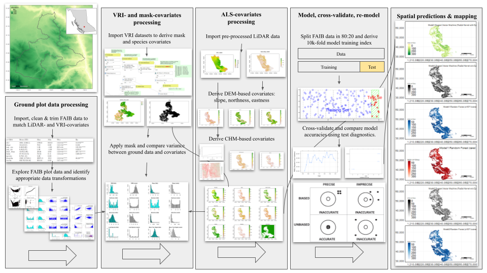

## Import LiDAR: Load, list and merge chunks

``` r
zip_file_vh_quesnel = ("/media/seamus/128GB_WORKD/EFI-TCC/LiDAR_Data/quesnel_region/VegHt.zip")
zip_file_be_quesnel = ("/media/seamus/128GB_WORKD/EFI-TCC/LiDAR_Data/quesnel_region/BareEarth.zip")
zip_dir_vh_quesnel = ("/media/seamus/128GB_WORKD/EFI-TCC/LiDAR_Data/quesnel_region")
zip_dir_be_quesnel = ("/media/seamus/128GB_WORKD/EFI-TCC/LiDAR_Data/quesnel_region")
unzip(zip_file_vh_quesnel, exdir = zip_dir_vh_quesnel, overwrite = TRUE)
unzip(zip_file_be_quesnel, exdir=zip_dir_be_quesnel, overwrite = TRUE)
unzip_dir_vh_quesnel <- paste0("/media/seamus/128GB_WORKD/EFI-TCC/LiDAR_Data/quesnel_region/VegHt")
unzip_dir_be_quesnel <- paste0("/media/seamus128GB_WORKD/EFI-TCC/LiDAR_Data/quesnel_region/BareEarth")
zip_file_vh_gaspard = ("/media/seamus/128GB_WORKD/EFI-TCC/LiDAR_Data/gaspard_region/VegHt.zip")
zip_file_be_gaspard = ("/media/seamus/128GB_WORKD/EFI-TCC/LiDAR_Data/gaspard_region/BareEarth.zip")
zip_dir_vh_gaspard = ("/media/seamus/128GB_WORKD/EFI-TCC/LiDAR_Data/gaspard_region")
zip_dir_be_gaspard = ("/media/seamus/128GB_WORKD/EFI-TCC/LiDAR_Data/gaspard_region")
unzip(zip_file_vh_gaspard, exdir=zip_dir_vh_gaspard, overwrite = TRUE)
unzip(zip_file_be_gaspard, exdir=zip_dir_be_gaspard, overwrite = TRUE)
unzip_dir_vh_gaspard <- paste0("/media/seamus/128GB_WORKD/EFI-TCC/LiDAR_Data/gaspard_region/VegHt")
unzip_dir_be_gaspard <- paste0("/media/seamus/128GB_WORKD/EFI-TCC/LiDAR_Data/gaspard_region/BareEarth")
filez_vh_quesnel = list.files(unzip_dir_vh_quesnel, full.names = T, all.files = FALSE, pattern = '.tif$') 
filez_be_quesnel = list.files(unzip_dir_be_quesnel, full.names = T, all.files = FALSE, pattern = '.tif$') 
filez_vh_gaspard = list.files(unzip_dir_vh_gaspard, full.names = T, all.files = FALSE, pattern = '.tif$') 
filez_be_gaspard = list.files(unzip_dir_be_gaspard, full.names = T, all.files = FALSE, pattern = '.tif$') 
lead_htop_raster_list_quesnel <- lapply(filez_vh_quesnel, raster)
lead_htop_raster_list_gaspard <- lapply(filez_vh_gaspard, raster)
elev_raster_list_quesnel <- lapply(filez_be_quesnel, raster)
elev_raster_list_gaspard <- lapply(filez_be_gaspard, raster)
lead_htop_raster_quesnel = do.call(merge, c(lead_htop_raster_list_quesnel, tolerance = 1))
lead_htop_raster_gaspard = do.call(merge, c(lead_htop_raster_list_gaspard, tolerance = 1))
elev_raster_quesnel = do.call(merge, c(elev_raster_list_quesnel, tolerance = 1))
elev_raster_gaspard = do.call(merge, c(elev_raster_list_gaspard, tolerance = 1))

writeRaster(lead_htop_raster_quesnel, filename = "/media/seamus/128GB_WORKD/EFI-TCC/LiDAR_Data/quesnel_region/lead_htop_raster.tif", overwrite=TRUE)
writeRaster(lead_htop_raster_gaspard, filename = "/media/seamus/128GB_WORKD/EFI-TCC/LiDAR_Data/gaspard_region/lead_htop_raster.tif", overwrite=TRUE)
writeRaster(elev_raster_quesnel, filename = "/media/seamus/128GB_WORKD/EFI-TCC/LiDAR_Data/quesnel_region/elev_raster.tif", overwrite=TRUE)
writeRaster(elev_raster_gaspard, filename = "/media/seamus/128GB_WORKD/EFI-TCC/LiDAR_Data/gaspard_region/elev_raster.tif", overwrite=TRUE)
```

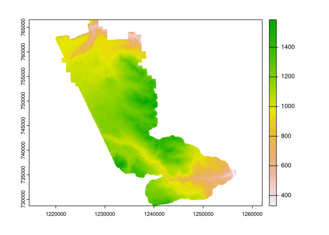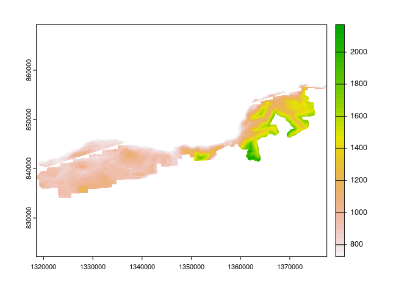

## CHM-derived covariates: Variable window function

``` r
kernel <- matrix(1,3,3)
wf_quan<-function(x){ 
  a=0.179-0.1
  b=0.51+0.5 
  y<-a*x+b 
  return(y)}
wf_plowright<-function(x){ 
  a=0.05
  b=0.6 
  y<-a*x+b 
  return(y)}
heights <- seq(0,40,0.5)
window_quan <- wf_quan(heights)
window_plowright <- wf_plowright(heights)
plot(heights, window_quan, type = "l",  ylim = c(0,12), xlab="point elevation (m)", ylab="window diameter (m)", main='Quan, 2022')
plot(heights, window_plowright, type = "l", ylim = c(0,12), xlab="point elevation (m)", ylab="window diameter (m)", main='Plowright, 2018')
```

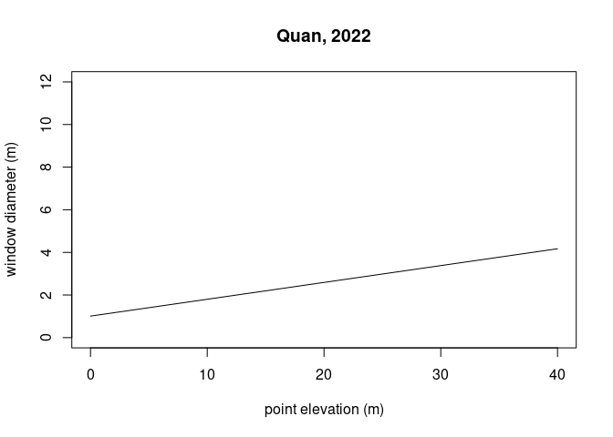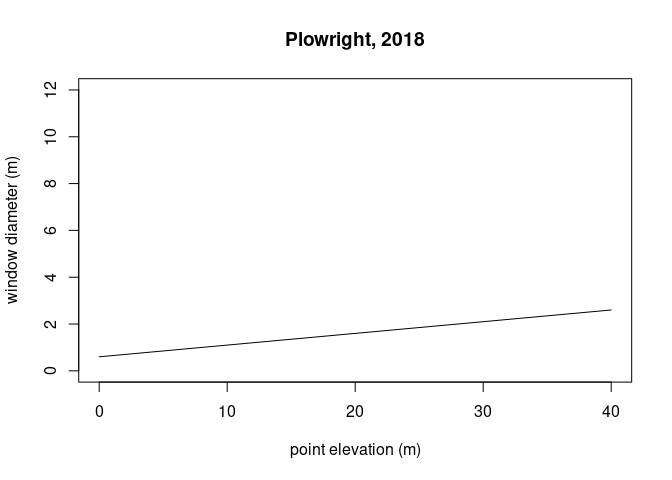

## CHM-derived covariates: Stem-detection & 95% height

``` r
lead_htop_raster_1m_smoothed_quesnel = focal(lead_htop_rast_quesnel, w = kernel, fun = median, na.rm = TRUE) %>% raster()
lead_htop_raster_1m_smoothed_gaspard = focal(lead_htop_rast_gaspard, w = kernel, fun = median, na.rm = TRUE) %>% raster()
ttops_2m_quan_quesnel <- ForestTools::vwf(lead_htop_raster_1m_smoothed_quesnel, wf_quan, 2)
ttops_2m_quan_gaspard = ForestTools::vwf(CHM = lead_htop_raster_1m_smoothed_gaspard, winFun = wf_quan, minHeight = 2)
ttops_2m_plowright_quesnel = ForestTools::vwf(CHM = lead_htop_raster_1m_smoothed_quesnel, winFun = wf_plowright, minHeight = 2)
ttops_2m_plowright_gaspard = ForestTools::vwf(CHM = lead_htop_raster_1m_smoothed_gaspard, winFun = wf_plowright, minHeight = 2)
writeOGR(ttops_2m_quan_quesnel, "/media/seamus/128GB_WORKD/data/vector/stem_maps", "treetops_quan_quesnel", driver = "ESRI Shapefile")
writeOGR(ttops_2m_quan_gaspard, "/media/seamus/128GB_WORKD/data/vector/stem_maps", "treetops_quan_gaspard", driver = "ESRI Shapefile")
writeOGR(ttops_2m_plowright_quesnel, "/media/seamus/128GB_WORKD/data/vector/stem_maps", "treetops_plowright_quesnel", driver = "ESRI Shapefile")
writeOGR(ttops_2m_plowright_gaspard, "/media/seamus/128GB_WORKD/data/vector/stem_maps", "treetops_plowright_gaspard", driver = "ESRI Shapefile")

quant95 <- function(x, ...) 
  quantile(x, c(0.95), na.rm = TRUE)
custFuns <- list(quant95, max)
names(custFuns) <- c("95thQuantile", "Max")

ttops_2m_quan_quesnel <- readOGR(dsn = "/media/seamus/128GB_WORKD/data/vector/stem_maps/treetops_quan_quesnel.shp", layer="treetops_quan_quesnel")
ttops_2m_quan_gaspard <- readOGR(dsn = "/media/seamus/128GB_WORKD/data/vector/stem_maps/treetops_quan_gaspard.shp", layer="treetops_quan_gaspard")
ttops_2m_Quan_raster_2m1.5m_95th_20cell_quesnel <- ForestTools::sp_summarise(ttops_2m_quan_quesnel, grid = 20, variables = "height", statFuns = custFuns)
ttops_2m_Quan_raster_2m1.5m_95th_20cell_gaspard <- ForestTools::sp_summarise(ttops_2m_quan_gaspard, grid = 20, variables = "height", statFuns = custFuns)
ttops_2m_Quan_raster_2m1.5m_95th_100cell_quesnel <- ForestTools::sp_summarise(ttops_2m_quan_quesnel, grid = 100, variables = "height", statFuns = custFuns)
ttops_2m_Quan_raster_2m1.5m_95th_100cell_gaspard <- ForestTools::sp_summarise(ttops_2m_quan_gaspard, grid = 100, variables = "height", statFuns = custFuns)
lead_htop_ttops_20cell_quesnel = ttops_2m_Quan_raster_2m1.5m_95th_20cell_quesnel[["height95thQuantile"]]
lead_htop_ttops_20cell_gaspard = ttops_2m_Quan_raster_2m1.5m_95th_20cell_gaspard[["height95thQuantile"]]
lead_htop_ttops_100cell_quesnel = ttops_2m_Quan_raster_2m1.5m_95th_100cell_quesnel[["height95thQuantile"]]
lead_htop_ttops_100cell_gaspard = ttops_2m_Quan_raster_2m1.5m_95th_100cell_gaspard[["height95thQuantile"]]
stemsha_L_ttops_20cell_quesnel = ttops_2m_Quan_raster_2m1.5m_95th_20cell_quesnel[["TreeCount"]]
stemsha_L_ttops_20cell_gaspard = ttops_2m_Quan_raster_2m1.5m_95th_20cell_gaspard[["TreeCount"]]
stemsha_L_ttops_100cell_quesnel = ttops_2m_Quan_raster_2m1.5m_95th_100cell_quesnel[["TreeCount"]]
stemsha_L_ttops_100cell_gaspard = ttops_2m_Quan_raster_2m1.5m_95th_100cell_gaspard[["TreeCount"]]
raster::writeRaster(lead_htop_ttops_20cell_quesnel, filename = "/media/seamus/128GB_WORKD/data/raster/tcc/lead_htop_95th/lead_htop_ttops_20cell_quesnel.tif", overwrite=TRUE)
raster::writeRaster(lead_htop_ttops_20cell_gaspard, filename = "/media/seamus/128GB_WORKD/data/raster/tcc/lead_htop_95th/lead_htop_ttops_20cell_gaspard.tif", overwrite=TRUE)
raster::writeRaster(lead_htop_ttops_100cell_quesnel, filename = "/media/seamus/128GB_WORKD/data/raster/tcc/lead_htop_95th/lead_htop_ttops_100cell_quesnel.tif", overwrite=TRUE)
raster::writeRaster(lead_htop_ttops_100cell_gaspard, filename = "/media/seamus/128GB_WORKD/data/raster/tcc/lead_htop_95th/lead_htop_ttops_100cell_gaspard.tif", overwrite=TRUE)
raster::writeRaster(stemsha_L_ttops_20cell_quesnel, filename = "/media/seamus/128GB_WORKD/data/raster/tcc/stemsha_L_95th/stemsha_L_ttops_20cell_quesnel.tif", overwrite=TRUE)
raster::writeRaster(stemsha_L_ttops_20cell_gaspard, filename = "/media/seamus/128GB_WORKD/data/raster/tcc/stemsha_L_95th/stemsha_L_ttops_20cell_gaspard.tif", overwrite=TRUE)
raster::writeRaster(stemsha_L_ttops_100cell_quesnel, filename = "/media/seamus/128GB_WORKD/data/raster/tcc/stemsha_L_95th/stemsha_L_ttops_100cell_quesnel.tif", overwrite=TRUE)
raster::writeRaster(stemsha_L_ttops_100cell_gaspard, filename = "/media/seamus/128GB_WORKD/data/raster/tcc/stemsha_L_95th/stemsha_L_ttops_100cell_gaspard.tif", overwrite=TRUE)
```

## DEM-derived covariates: Terrain rasters

``` r
terra::crs(elev_rast_quesnel) = "epsg:3005"
terra::crs(elev_rast_gaspard) = "epsg:3005"
elev_rast_quesnel = terra::aggregate(elev_rast_quesnel, fact = 20, fun = mean)
elev_rast_gaspard = terra::aggregate(elev_rast_gaspard, fact = 20, fun = mean)
slope_rast_quesnel = terra::terrain(elev_rast_quesnel, v="slope", unit="degrees", neighbors=8)
slope_rast_gaspard = terra::terrain(elev_rast_gaspard, v="slope", unit="degrees", neighbors=8)
aspect_rast_quesnel = terra::terrain(elev_rast_quesnel, v="aspect", unit="degrees", neighbors=8)
aspect_rast_gaspard = terra::terrain(elev_rast_gaspard, v="aspect", unit="degrees", neighbors=8)
asp_cos_rast_quesnel = cos((aspect_rast_quesnel*pi)/180)
asp_cos_rast_gaspard = cos((aspect_rast_gaspard*pi)/180)
asp_sin_rast_quesnel = sin((aspect_rast_quesnel*pi)/180)
asp_sin_rast_gaspard = sin((aspect_rast_gaspard*pi)/180)

lead_htop_rast_20cell_quesnel = terra::resample(lead_htop_rast_20cell_quesnel, elev_rast_quesnel)
lead_htop_rast_20cell_gaspard = terra::resample(lead_htop_rast_20cell_gaspard, elev_rast_gaspard)
stemsha_L_rast_20cell_quesnel = terra::resample(stemsha_L_rast_20cell_quesnel, elev_rast_quesnel)
stemsha_L_rast_20cell_gaspard = terra::resample(stemsha_L_rast_20cell_gaspard, elev_rast_gaspard)
species_class_rast_quesnel = terra::resample(species_class_rast_quesnel, elev_rast_quesnel)
species_class_rast_gaspard = terra::resample(species_class_rast_gaspard, elev_rast_gaspard)
elev_rast_quesnel = terra::mask(elev_rast_quesnel, lead_htop_rast_20cell_quesnel)
elev_rast_gaspard = terra::mask(elev_rast_gaspard, lead_htop_rast_20cell_gaspard)
slope_rast_quesnel = terra::mask(slope_rast_quesnel, lead_htop_rast_20cell_quesnel)
slope_rast_gaspard = terra::mask(slope_rast_gaspard, lead_htop_rast_20cell_gaspard)
asp_cos_rast_quesnel = terra::mask(asp_cos_rast_quesnel, lead_htop_rast_20cell_quesnel)
asp_cos_rast_gaspard = terra::mask(asp_cos_rast_gaspard, lead_htop_rast_20cell_gaspard)
asp_sin_rast_quesnel = terra::mask(asp_sin_rast_quesnel, lead_htop_rast_20cell_quesnel)
asp_sin_rast_gaspard = terra::mask(asp_sin_rast_gaspard, lead_htop_rast_20cell_gaspard)
species_class_rast_quesnel = terra::mask(species_class_rast_quesnel, lead_htop_rast_20cell_quesnel)
species_class_rast_gaspard = terra::mask(species_class_rast_gaspard, lead_htop_rast_20cell_gaspard)

writeRaster(elev_rast_quesnel, filename = "/media/seamus/128GB_WORKD/data/raster/tcc/elevation/elev_raster_quesnel.tif", overwrite=TRUE)
writeRaster(elev_rast_gaspard, filename = "/media/seamus/128GB_WORKD/data/raster/tcc/elevation/elev_raster_gaspard.tif", overwrite=TRUE)
writeRaster(slope_rast_quesnel, filename = "/media/seamus/128GB_WORKD/data/raster/tcc/slope/slope_raster_quesnel.tif", overwrite=TRUE)
writeRaster(slope_rast_gaspard, filename = "/media/seamus/128GB_WORKD/data/raster/tcc/slope/slope_raster_gaspard.tif", overwrite=TRUE)
writeRaster(asp_cos_rast_quesnel, filename = "/media/seamus/128GB_WORKD/data/raster/tcc/aspect/asp_cos_raster_quesnel.tif", overwrite=TRUE)
writeRaster(asp_cos_rast_gaspard, filename = "/media/seamus/128GB_WORKD/data/raster/tcc/aspect/asp_cos_raster_gaspard.tif", overwrite=TRUE)
writeRaster(asp_sin_rast_quesnel, filename = "/media/seamus/128GB_WORKD/data/raster/tcc/aspect/asp_sin_raster_quesnel.tif", overwrite=TRUE)
writeRaster(asp_sin_rast_gaspard, filename = "/media/seamus/128GB_WORKD/data/raster/tcc/aspect/asp_sin_raster_gaspard.tif", overwrite=TRUE)
writeRaster(species_class_rast_quesnel, filename = "/media/seamus/128GB_WORKD/data/raster/tcc/species/species_class_raster_quesnel.tif", overwrite=TRUE)
writeRaster(species_class_rast_gaspard, filename = "/media/seamus/128GB_WORKD/data/raster/tcc/species/species_class_raster_gaspard.tif", overwrite=TRUE)
```

## Species covariates: VRI rasterization

``` r
lead_htop_rast_20cell_quesnel = terra::rast("/media/seamus/128GB_WORKD/data/raster/tcc/lead_htop_95th/lead_htop_ttops_20cell_quesnel.tif")
lead_htop_rast_20cell_gaspard = terra::rast("/media/seamus/128GB_WORKD/data/raster/tcc/lead_htop_95th/lead_htop_ttops_20cell_gaspard.tif")
stemsha_L_rast_20cell_quesnel = terra::rast("/media/seamus/128GB_WORKD/data/raster/tcc/stemsha_L_95th/stemsha_L_ttops_20cell_quesnel.tif")
stemsha_L_rast_20cell_gaspard = terra::rast("/media/seamus/128GB_WORKD/data/raster/tcc/stemsha_L_95th/stemsha_L_ttops_20cell_gaspard.tif")
crs(lead_htop_rast_20cell_quesnel) = "epsg:3005"
crs(lead_htop_rast_20cell_gaspard) = "epsg:3005"
lead_htop_sv_20cell_quesnel = as.polygons(lead_htop_rast_20cell_quesnel)
lead_htop_sv_20cell_gaspard = as.polygons(lead_htop_rast_20cell_gaspard)
lead_htop_sf_20cell_quesnel = sf::st_as_sf(lead_htop_sv_20cell_quesnel)
lead_htop_sf_20cell_gaspard = sf::st_as_sf(lead_htop_sv_20cell_gaspard)

vri_sf = read_sf("/media/seamus/128GB_WORKD/data/vector/vri/vri_bc_2020_rank1.shp")
vri_species = vri_sf[c("SPECIES__1", "SPECIES_CD", "SPECIES_PC")]
vri_species_aoi =  dplyr::filter(vri_species, SPECIES__1=='PL' | SPECIES__1=='PLI' | SPECIES__1=='FD' | SPECIES__1=='FDI' | SPECIES__1=='SB' | SPECIES__1=='SE' | SPECIES__1=='SW' | SPECIES__1=='SX' | SPECIES__1=='CW' | SPECIES__1=='HW' | SPECIES__1=='BL' | SPECIES__1=='LW')
vri_species_aoi = vri_species_aoi[!(vri_species_aoi$SPECIES__1 == 'FD' & vri_species_aoi$SPECIES_PC >= 50 | vri_species_aoi$SPECIES__1 == 'FDI' & vri_species_aoi$SPECIES_PC >=50),]
vri_species_aoi$SPECIES__1 = dplyr::recode(vri_species_aoi$SPECIES__1, PL = 0, PLI = 0, SB = 1, SE = 1, SW = 1, SX = 1, FD = 2, FDI = 2, CW = 3, HW = 4, BL = 5, LW = 6)
vri_species_aoi = dplyr::rename(vri_species_aoi, species_class = SPECIES__1)
vri_species_aoi = vri_species_aoi["species_class"]
vri_species_aoi_sf = sf::st_as_sf(vri_species_aoi)
vri_species_aoi_quesnel = st_intersection(vri_species_aoi_sf, st_make_valid(lead_htop_sf_20cell_quesnel))
vri_species_aoi_gaspard = st_intersection(vri_species_aoi_sf, st_make_valid(lead_htop_sf_20cell_gaspard))
species_class_rast_quesnel = terra::rasterize(vect(vri_species_aoi_quesnel), lead_htop_rast_20cell_quesnel, field = "species_class", touches = TRUE)
species_class_rast_gaspard = terra::rasterize(vect(vri_species_aoi_gaspard), lead_htop_rast_20cell_gaspard, field = "species_class", touches = TRUE)
species_class_raster_quesnel = raster::raster(species_class_rast_quesnel)
species_class_raster_gaspard = raster::raster(species_class_rast_gaspard)
raster::writeRaster(species_class_raster_quesnel, filename = "/media/seamus/128GB_WORKD/data/raster/tcc/species/species_class_raster_quesnel.tif", overwrite=TRUE)
raster::writeRaster(species_class_raster_gaspard, filename = "/media/seamus/128GB_WORKD/data/raster/tcc/species/species_class_raster_gaspard.tif", overwrite=TRUE)
```

## Mask layers: Merging and clipping

``` r
mask_burn2017 = sf::read_sf("/media/seamus/128GB_WORKD/data/vector/tcc_mask_layers/TCC_Burn_Severity TCC_Burn_Severity_2017.shp")
mask_burn2018 = sf::read_sf("/media/seamus/128GB_WORKD/data/vector/tcc_mask_layers/TCC_Burn_Severity TCC_Burn_Severity_2018.shp")
mask_burn2021 = sf::read_sf("/media/seamus/128GB_WORKD/data/vector/tcc_mask_layers/TCC_Burn_Severity TCC_Burn_Severity_2021.shp")
mask_burn2017 = mask_burn2017["BurnSev"]
mask_burn2018 = mask_burn2018["BurnSev"]
mask_burn2021 = mask_burn2021["BurnSev"]
mask_burn2017 = dplyr::filter(mask_burn2017, BurnSev == 'High')
mask_burn2018 = dplyr::filter(mask_burn2018, BurnSev == 'High')
mask_burn2021 = dplyr::filter(mask_burn2021, BurnSev == 'High')
mask_burn2017_quesnel = sf::st_intersection(sf::st_make_valid(mask_burn2017), lead_htop_sf_20cell_quesnel)
mask_burn2017_gaspard = sf::st_intersection(sf::st_make_valid(mask_burn2017), lead_htop_sf_20cell_gaspard)
mask_burn2018_quesnel = sf::st_intersection(sf::st_make_valid(mask_burn2018), lead_htop_sf_20cell_quesnel)
mask_burn2018_gaspard = sf::st_intersection(sf::st_make_valid(mask_burn2018), lead_htop_sf_20cell_gaspard)
mask_burn2021_quesnel = sf::st_intersection(sf::st_make_valid(mask_burn2021), lead_htop_sf_20cell_quesnel)
mask_burn2021_gaspard = sf::st_intersection(sf::st_make_valid(mask_burn2021), lead_htop_sf_20cell_gaspard)
masks_df_quesnel = full_join(as_tibble(mask_burn2017_quesnel), as_tibble(mask_burn2018_quesnel), as_tibble(mask_burn2021_quesnel), by = "geometry")
masks_df_gaspard = full_join(as_tibble(mask_burn2017_gaspard), as_tibble(mask_burn2018_gaspard), as_tibble(mask_burn2021_gaspard), by = "geometry")
masks_sf_quesnel = st_as_sf(masks_df_quesnel) # easier to combine by 'geometry'
masks_sf_gaspard = st_as_sf(masks_df_gaspard) # easier to combine by 'geometry'

mask_clearcut = sf::read_sf("/media/seamus/128GB_WORKD/data/vector/tcc_mask_layers/RSLT_CCRES_CLEAR.shp")
mask_clearcut_quesnel = sf::st_intersection(mask_clearcut, st_make_valid(lead_htop_sf_20cell_quesnel))
mask_clearcut_gaspard = sf::st_intersection(mask_clearcut, st_make_valid(lead_htop_sf_20cell_gaspard))
masks_df_quesnel = full_join(as_tibble(masks_sf_quesnel), as_tibble(mask_clearcut_quesnel), by = 'geometry')
masks_df_gaspard = full_join(as_tibble(masks_sf_gaspard), as_tibble(mask_clearcut_gaspard), by = 'geometry')
masks_sf_quesnel = st_as_sf(masks_df_quesnel)
masks_sf_gaspard = st_as_sf(masks_df_gaspard)

mask_blocks = sf::read_sf("/media/seamus/128GB_WORKD/data/vector/tcc_mask_layers/TCC_Blocks_Join.shp")
mask_blocks_quesnel = sf::st_intersection(mask_blocks, st_make_valid(lead_htop_sf_20cell_quesnel))
mask_blocks_gaspard = sf::st_intersection(mask_blocks, st_make_valid(lead_htop_sf_20cell_gaspard))
masks_df_quesnel = full_join(as_tibble(masks_sf_quesnel), as_tibble(mask_blocks_quesnel), by = 'geometry')
masks_df_gaspard = full_join(as_tibble(masks_sf_gaspard), as_tibble(mask_blocks_gaspard), by = 'geometry')
masks_sf_quesnel = st_as_sf(masks_df_quesnel)
masks_sf_gaspard = st_as_sf(masks_df_gaspard)

mask_roads_tcc = sf::read_sf("/media/seamus/128GB_WORKD/data/vector/tcc_mask_layers/TCC_Roads.shp")
mask_roads_tcc = sf::st_zm(mask_roads_tcc)
mask_roads_tcc_quesnel = sf::st_intersection(mask_roads_tcc, st_make_valid(lead_htop_sf_20cell_quesnel))
mask_roads_tcc_gaspard = sf::st_intersection(mask_roads_tcc, st_make_valid(lead_htop_sf_20cell_gaspard))
mask_roads_tcc_quesnel = sf::st_buffer(mask_roads_tcc_quesnel, dist = 15, nQuadSegs = 5, endCapStyle = "ROUND", joinStyle = "ROUND", mitreLimit = 2)
mask_roads_tcc_gaspard = sf::st_buffer(mask_roads_tcc_gaspard, dist = 15, nQuadSegs = 5, endCapStyle = "ROUND", joinStyle = "ROUND", mitreLimit = 2)

mask_roads_ften = sf::read_sf("/media/seamus/128GB_WORKD/data/vector/tcc_mask_layers/FTEN_Roads_All.shp")
mask_roads_ften = sf::st_zm(mask_roads_ften)
mask_roads_ften_quesnel = sf::st_intersection(mask_roads_ften, st_make_valid(lead_htop_sf_20cell_quesnel))
mask_roads_ften_gaspard = sf::st_intersection(mask_roads_ften, st_make_valid(lead_htop_sf_20cell_gaspard))
mask_roads_ften_quesnel = sf::st_buffer(mask_roads_ften_quesnel, dist = 15, nQuadSegs = 5, endCapStyle = "ROUND", joinStyle = "ROUND", mitreLimit = 2)
mask_roads_ften_gaspard = sf::st_buffer(mask_roads_ften_gaspard, dist = 15, nQuadSegs = 5, endCapStyle = "ROUND", joinStyle = "ROUND", mitreLimit = 2)
masks_df_quesnel = full_join(as_tibble(masks_sf_quesnel), as_tibble(mask_roads_tcc_quesnel), as_tibble(mask_roads_ften_quesnel), by = 'geometry')
masks_df_gaspard = full_join(as_tibble(masks_sf_gaspard), as_tibble(mask_roads_tcc_gaspard), as_tibble(mask_roads_ften_gaspard), by = 'geometry')
masks_sf_quesnel = st_as_sf(masks_df_quesnel)
masks_sf_gaspard = st_as_sf(masks_df_gaspard)
masks_rast_quesnel = rasterize(vect(masks_sf_quesnel), lead_htop_rast_20cell_quesnel, touches = TRUE)
masks_rast_gaspard = rasterize(vect(masks_sf_gaspard), lead_htop_rast_20cell_gaspard, touches = TRUE)
masks_raster_quesnel = raster::raster(masks_rast_quesnel)
masks_raster_gaspard = raster::raster(masks_rast_gaspard)
writeRaster(masks_raster_quesnel, filename = "/media/seamus/128GB_WORKD/data/vector/tcc_mask_layers/mask_raster_quesnel.tif", overwrite=TRUE)
writeRaster(masks_raster_gaspard, filename = "/media/seamus/128GB_WORKD/data/vector/tcc_mask_layers/mask_raster_gaspard.tif", overwrite=TRUE)
ggplot(masks_sf_gaspard) + geom_sf(aes(fill = 'red'), show.legend = FALSE)
ggplot(masks_sf_quesnel) + geom_sf(aes(fill = 'red'), show.legend = FALSE)
```

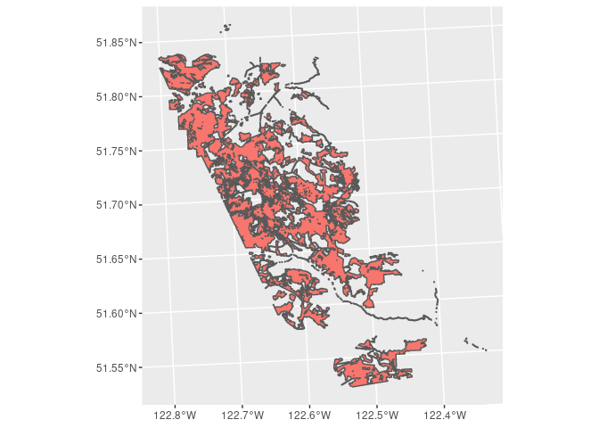

## Mask layers: Apply masking & stack covariates

``` r
masks_rast_quesnel = terra::resample(masks_rast_quesnel, lead_htop_rast_20cell_quesnel, method="near")
masks_rast_gaspard = terra::resample(masks_rast_gaspard, lead_htop_rast_20cell_gaspard, method="near")
lead_htop_rast_20cell_quesnel = mask(lead_htop_rast_20cell_quesnel, masks_rast_quesnel, inverse=TRUE)
lead_htop_rast_20cell_gaspard = mask(lead_htop_rast_20cell_gaspard, masks_rast_gaspard, inverse=TRUE)
elev_rast_quesnel = mask(elev_rast_quesnel, masks_rast_quesnel, inverse=TRUE)
elev_rast_gaspard = mask(elev_rast_gaspard, masks_rast_gaspard, inverse=TRUE)
slope_rast_quesnel = mask(slope_rast_quesnel, masks_rast_quesnel, inverse=TRUE)
slope_rast_gaspard = mask(slope_rast_gaspard, masks_rast_gaspard, inverse=TRUE)
asp_cos_rast_quesnel = mask(asp_cos_rast_quesnel, masks_rast_quesnel, inverse=TRUE)
asp_cos_rast_gaspard = mask(asp_cos_rast_gaspard, masks_rast_gaspard, inverse=TRUE)
asp_sin_rast_quesnel = mask(asp_sin_rast_quesnel, masks_rast_quesnel, inverse=TRUE)
asp_sin_rast_gaspard = mask(asp_sin_rast_gaspard, masks_rast_gaspard, inverse=TRUE)
stemsha_L_rast_20cell_quesnel = mask(stemsha_L_rast_20cell_quesnel, masks_rast_quesnel, inverse=TRUE)
stemsha_L_rast_20cell_gaspard = mask(stemsha_L_rast_20cell_gaspard, masks_rast_gaspard, inverse=TRUE)
species_class_rast_quesnel = mask(species_class_rast_quesnel, masks_rast_quesnel, inverse=TRUE)
species_class_rast_gaspard = mask(species_class_rast_gaspard, masks_rast_gaspard, inverse=TRUE)

writeRaster(elev_rast_quesnel, filename = "/media/seamus/128GB_WORKD/data/raster/tcc/masked-covariates/elev_raster_20cell_quesnel.tif", overwrite=TRUE)
writeRaster(elev_rast_gaspard, filename = "/media/seamus/128GB_WORKD/data/raster/tcc/masked-covariates/elev_raster_20cell_gaspard.tif", overwrite=TRUE)
writeRaster(slope_rast_quesnel, filename = "/media/seamus/128GB_WORKD/data/raster/tcc/masked-covariates/slope_raster_20cell_quesnel.tif", overwrite=TRUE)
writeRaster(slope_rast_gaspard, filename = "/media/seamus/128GB_WORKD/data/raster/tcc/masked-covariates/slope_raster_20cell_gaspard.tif", overwrite=TRUE)
writeRaster(asp_cos_rast_quesnel, filename = "/media/seamus/128GB_WORKD/data/raster/tcc/masked-covariates/asp_cos_raster_20cell_quesnel.tif", overwrite=TRUE)
writeRaster(asp_cos_rast_gaspard, filename = "/media/seamus/128GB_WORKD/data/raster/tcc/masked-covariates/asp_cos_raster_20cell_gaspard.tif", overwrite=TRUE)
writeRaster(asp_sin_rast_quesnel, filename = "/media/seamus/128GB_WORKD/data/raster/tcc/masked-covariates/asp_sin_raster_20cell_quesnel.tif", overwrite=TRUE)
writeRaster(asp_sin_rast_gaspard, filename = "/media/seamus/128GB_WORKD/data/raster/tcc/masked-covariates/asp_sin_raster_20cell_gaspard.tif", overwrite=TRUE)
writeRaster(species_class_rast_quesnel, filename = "/media/seamus/128GB_WORKD/data/raster/tcc/masked-covariates/species_class_raster_20cell_quesnel.tif", overwrite=TRUE)
writeRaster(species_class_rast_gaspard, filename = "/media/seamus/128GB_WORKD/data/raster/tcc/masked-covariates/species_class_raster_20cell_gaspard.tif", overwrite=TRUE)
writeRaster(stemsha_L_rast_20cell_quesnel, filename = "/media/seamus/128GB_WORKD/data/raster/tcc/masked-covariates/stemsha_L_rast_20cell_quesnel.tif", overwrite=TRUE)
writeRaster(stemsha_L_rast_20cell_gaspard, filename = "/media/seamus/128GB_WORKD/data/raster/tcc/masked-covariates/stemsha_L_rast_20cell_gaspard.tif", overwrite=TRUE)
writeRaster(lead_htop_rast_20cell_quesnel, filename = "/media/seamus/128GB_WORKD/data/raster/tcc/masked-covariates/lead_htop_rast_20cell_quesnel.tif", overwrite=TRUE)
writeRaster(lead_htop_rast_20cell_gaspard, filename = "/media/seamus/128GB_WORKD/data/raster/tcc/masked-covariates/lead_htop_rast_20cell_gaspard.tif", overwrite=TRUE)

elev_raster_quesnel = raster::raster(elev_rast_quesnel)
slope_raster_quesnel = raster::raster(slope_rast_quesnel)
asp_cos_raster_quesnel = raster::raster(asp_cos_rast_quesnel)
asp_sin_raster_quesnel = raster::raster(asp_sin_rast_quesnel)
species_class_raster_quesnel = raster::raster(species_class_rast_quesnel)
stemsha_L_raster_quesnel = raster::raster(stemsha_L_rast_20cell_quesnel)
lead_htop_raster_quesnel = raster::raster(lead_htop_rast_20cell_quesnel)

elev_raster_gaspard = raster::raster(elev_rast_gaspard)
slope_raster_gaspard = raster::raster(slope_rast_gaspard)
asp_cos_raster_gaspard = raster::raster(asp_cos_rast_gaspard)
asp_sin_raster_gaspard = raster::raster(asp_sin_rast_gaspard)
species_class_raster_gaspard = raster::raster(species_class_rast_gaspard)
stemsha_L_raster_gaspard = raster::raster(stemsha_L_rast_20cell_gaspard)
lead_htop_raster_gaspard = raster::raster(lead_htop_rast_20cell_gaspard)

elev_raster_list = list(elev_raster_quesnel, elev_raster_gaspard)
slope_raster_list = list(slope_raster_quesnel, slope_raster_gaspard)
asp_cos_raster_list = list(asp_cos_raster_quesnel, asp_cos_raster_gaspard)
asp_sin_raster_list = list(asp_sin_raster_quesnel, asp_sin_raster_gaspard)
species_class_raster_list = list(species_class_raster_quesnel, species_class_raster_gaspard)
stemsha_L_raster_list = list(stemsha_L_raster_quesnel, stemsha_L_raster_gaspard)
lead_htop_raster_list = list(lead_htop_raster_quesnel, lead_htop_raster_gaspard)

elev_raster = do.call(merge, c(elev_raster_list, tolerance = 1))
slope_raster = do.call(merge, c(slope_raster_list, tolerance = 1))
asp_cos_raster = do.call(merge, c(asp_cos_raster_list, tolerance = 1))
asp_sin_raster = do.call(merge, c(asp_sin_raster_list, tolerance = 1))
species_class_raster = do.call(merge, c(species_class_raster_list, tolerance = 1))
stemsha_L_raster = do.call(merge, c(stemsha_L_raster_list, tolerance = 1))
lead_htop_raster = do.call(merge, c(lead_htop_raster_list, tolerance = 1))

writeRaster(elev_raster, filename = "/media/seamus/128GB_WORKD/data/raster/tcc/masked-covariates/elev_raster_20cell_allSites.tif", overwrite=TRUE)
writeRaster(slope_raster, filename = "/media/seamus/128GB_WORKD/data/raster/tcc/masked-covariates/slope_raster_20cell_allSites.tif", overwrite=TRUE)
writeRaster(asp_cos_raster, filename = "/media/seamus/128GB_WORKD/data/raster/tcc/masked-covariates/asp_cos_raster_20cell_allSites.tif", overwrite=TRUE)
writeRaster(asp_sin_raster, filename = "/media/seamus/128GB_WORKD/data/raster/tcc/masked-covariates/asp_sin_raster_20cell_allSites.tif", overwrite=TRUE)
writeRaster(species_class_raster, filename = "/media/seamus/128GB_WORKD/data/raster/tcc/masked-covariates/species_class_raster_20cell_allSites.tif", overwrite=TRUE)
writeRaster(stemsha_L_raster, filename = "/media/seamus/128GB_WORKD/data/raster/tcc/masked-covariates/stemsha_L_raster_20cell_allSites.tif", overwrite=TRUE)
writeRaster(lead_htop_raster, filename = "/media/seamus/128GB_WORKD/data/raster/tcc/masked-covariates/lead_htop_raster_20cell_allSites.tif", overwrite=TRUE)

covs_m1_quesnel = raster::stack(
  elev_raster_quesnel, 
  slope_raster_quesnel,
  #aspect_raster_quesnel,
  asp_cos_raster_quesnel,
  asp_sin_raster_quesnel,
  species_class_raster_quesnel,
  lead_htop_raster_quesnel,
  stemsha_L_raster_quesnel)

covs_m1_gaspard = raster::stack(
  elev_raster_gaspard, 
  slope_raster_gaspard,
  #aspect_raster_gaspard,
  asp_cos_raster_gaspard,
  asp_sin_raster_gaspard,
  species_class_raster_gaspard,
  lead_htop_raster_gaspard,
  stemsha_L_raster_gaspard)

covs_m2_quesnel = raster::stack(
  elev_raster_quesnel, 
  slope_raster_quesnel,
  #aspect_raster_quesnel,
  asp_cos_raster_quesnel,
  asp_sin_raster_quesnel,
  species_class_raster_quesnel,
  lead_htop_raster_quesnel)

covs_m2_gaspard = raster::stack(
  elev_raster_gaspard, 
  slope_raster_gaspard,
  #aspect_raster_gaspard,
  asp_cos_raster_gaspard,
  asp_sin_raster_gaspard,
  species_class_raster_gaspard,
  lead_htop_raster_gaspard)

covs_m2 = raster::stack(
  elev_raster, 
  slope_raster,
  #aspect_raster, 
  asp_cos_raster,
  asp_sin_raster,
  lead_htop_raster,
  species_class_raster)

covs_m1 = raster::stack(
  elev_raster, 
  slope_raster,
  #aspect_raster, 
  asp_cos_raster,
  asp_sin_raster,
  lead_htop_raster,
  species_class_raster,
  stemsha_L_raster)

rasterVis::levelplot(covs_m1)
```

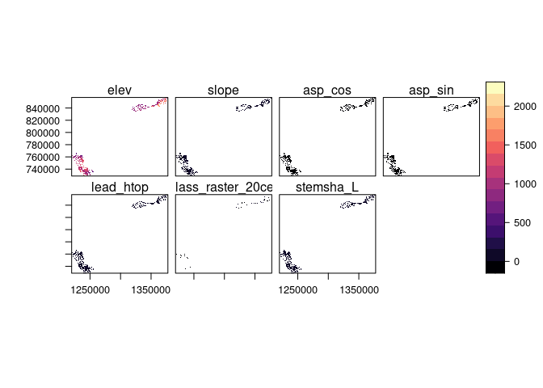<!-- -->

## Tidy plot data: Bootstrapped resampling

``` r
faib_psp <- read.csv("/media/seamus/128GB_WORKD/EFI-TCC/0_Caret_Predict_to_writeRasterOutput/Data/FAIB_PSP_20211028.csv")
faib_psp = subset(faib_psp, util == '12.5')
faib_psp$spc_live1 = as.factor(faib_psp$spc_live1)
faib_psp =  subset(faib_psp, 
    spc_live1=='PL' | spc_live1=='PLI' | spc_live1=='FD'| spc_live1=='FDI' | 
    spc_live1=='SB' | spc_live1=='SE' | spc_live1=='SW' | spc_live1=='SX' | 
    spc_live1=='CW' | spc_live1=='HW' | spc_live1=='BL' | spc_live1=='LW')
faib_psp$species_class = dplyr::recode(faib_psp$spc_live1, 
  PL = 1, PLI = 1, SB = 2, SE = 2, SX = 2, 
  FD = 3, FDI = 3, CW = 3, HW = 4, BL = 5, LW = 6)
faib_psp$asp_cos = cos((faib_psp$aspect * pi) / 180)
faib_psp$asp_sin = sin((faib_psp$aspect * pi) / 180)
faib_psp = subset(faib_psp, stemsha_L < 834)
faib_psp = faib_psp[c("elev", "slope", "asp_cos", "asp_sin", "lead_htop", "species_class", "stemsha_L", "wsvha_L")]
stemsha_L_raster_df = as.data.frame(rasterToPoints(stemsha_L_raster))
dist.fun = approxfun(density(stemsha_L_raster_df$stemsha_L))
faib_psp = faib_psp %>% 
  slice_sample(n=1186, weight_by = dist.fun(faib_psp$stemsha_L), replace = T)

truehist(faib_psp$stemsha_L, main="Stems/ha (faib)", maxpixels=22000000)
hist(stemsha_L_raster, main="Stems/ha (all sites)", maxpixels=22000000)
hist(stemsha_L_raster_gaspard, main="Stems/ha (Gaspard)", maxpixels=22000000)
hist(stemsha_L_raster_quesnel, main="Stems/ha (Quesnel)", maxpixels=22000000)
```


## Tidy plot data: Data cleaning & training-test split

``` r
faib_psp$elev = as.numeric(faib_psp$elev)
faib_psp$slope = as.numeric(faib_psp$slope)
faib_psp$asp_cos = as.numeric(faib_psp$asp_cos)
faib_psp$asp_sin = as.numeric(faib_psp$asp_sin)
faib_psp$lead_htop = as.numeric(faib_psp$lead_htop)
faib_psp$species_class = as.numeric(faib_psp$species_class)
faib_psp$stemsha_L = as.numeric(faib_psp$stemsha_L)
faib_psp$wsvha_L = as.numeric(faib_psp$wsvha_L)

faib_psp$elev[faib_psp$elev <= 0] = NA
faib_psp$slope[faib_psp$slope <= 0] = NA
faib_psp$lead_htop[faib_psp$lead_htop < 2] = NA
faib_psp$stemsha_L[faib_psp$stemsha_L <= 0] = NA
faib_psp$wsvha_L[faib_psp$wsvha_L <= 0] = NA

faib_vri_true_m1_df = faib_psp[c("elev", "slope", "asp_cos", "asp_sin", "lead_htop", "species_class", "stemsha_L", "wsvha_L")]
faib_vri_true_m2_df = faib_psp[c("elev", "slope", "asp_cos", "asp_sin", "lead_htop", "species_class", "wsvha_L")] 
faib_vri_true_m1_df = na.omit(faib_vri_true_m1_df)
faib_vri_true_m2_df = na.omit(faib_vri_true_m2_df)

n <- nrow(faib_vri_true_m1_df)
frac <- 0.8
ix <- sample(n, frac * n)
train_m1 = faib_vri_true_m1_df[ix,]
test_m1 = faib_vri_true_m1_df[-ix,]
train_m2 = faib_vri_true_m2_df[ix,]
test_m2 = faib_vri_true_m2_df[-ix,]

X_train_m1=train_m1[,-8]
X_test_m1=test_m1[,-8]
y_train_m1=train_m1[,8]
y_test_m1=test_m1[,8]

X_train_m2=train_m2[,-7]
X_test_m2=test_m2[,-7]
y_train_m2=train_m2[,7]
y_test_m2=test_m2[,7]

X_m1 = faib_vri_true_m1_df[,-8]
y_m1 = faib_vri_true_m1_df[,8]
X_m2 = faib_vri_true_m2_df[,-7]
y_m2 = faib_vri_true_m2_df[,7]
```

    ## # A tibble: 634 × 8
    ##     elev slope   asp_cos asp_sin lead_htop species_class stemsha_L wsvha_L
    ##    <int> <int>     <dbl>   <dbl>     <dbl>         <dbl>     <dbl>   <dbl>
    ##  1   793    15 -1.84e-16  -1          23.0             1      770.    303.
    ##  2   793    15 -1.84e-16  -1          26.0             1      700.    384.
    ##  3   661     4  3.09e- 1   0.951      23.6             2      817.    338.
    ##  4   903     2  6.98e- 2  -0.998      18.3             1      315.    113.
    ##  5   903     2  6.98e- 2  -0.998      21.1             1      522.    184.
    ##  6   903     2  6.98e- 2  -0.998      24.4             1      660.    272.
    ##  7   903     2  6.98e- 2  -0.998      25.8             1      650.    356.
    ##  8   903     2  6.98e- 2  -0.998      26.0             2      414.    219.
    ##  9   825    10 -3.42e- 1  -0.940      18.3             2      335.    126.
    ## 10   825    10 -3.42e- 1  -0.940      21.7             2      325.    195.
    ## # … with 624 more rows

## Exploratory data analysis: Visualize distributions

``` r
truehist(faib_vri_true_m1_df$elev, main="DEM (faib)", maxpixels=22000000)
hist(elev_raster, main="DEM (all sites)", maxpixels=22000000)
hist(elev_raster_gaspard, main="DEM (Gaspard)", maxpixels=22000000)
hist(elev_raster_quesnel, main="DEM (Quesnel)", maxpixels=22000000)
truehist(faib_vri_true_m1_df$slope, main="Slope (faib)", maxpixels=22000000)
hist(slope_raster, main="Slope (all sites)", maxpixels=22000000) 
hist(slope_raster_gaspard, main="Slope (Gaspard)", maxpixels=22000000) 
hist(slope_raster_quesnel, main="Slope (Quesnel)", maxpixels=22000000) 
truehist(faib_vri_true_m1_df$asp_cos, main="Northness (faib)", maxpixels=22000000)
hist(asp_cos_raster, main="Northness (all sites)", maxpixels=22000000)
hist(asp_cos_raster_gaspard, main="Northness (Gaspard)", maxpixels=22000000)
hist(asp_cos_rast_quesnel, main="Northness (Quesnel)", maxpixels=22000000)
truehist(faib_vri_true_m1_df$asp_cos, main="Eastness (faib)", maxpixels=22000000)
hist(asp_cos_raster, main="Eastness (all sites)", maxpixels=22000000)
hist(asp_cos_raster_gaspard, main="Eastness (Gaspard)", maxpixels=22000000)
hist(asp_cos_rast_quesnel, main="Eastness (Quesnel)", maxpixels=22000000)
truehist(faib_vri_true_m1_df$stemsha_L, main="Stems/ha (faib)", maxpixels=22000000)
hist(stemsha_L_raster, main="Stems/ha (all sites)", maxpixels=22000000)
hist(stemsha_L_raster_gaspard, main="Stems/ha (Gaspard)", maxpixels=22000000)
hist(stemsha_L_raster_quesnel, main="Stems/ha (Quesnel)", maxpixels=22000000)
faib_vri_true_m1_df$species_class = as.numeric(faib_vri_true_m1_df$species_class)
truehist(faib_vri_true_m1_df$species_class, main="Lead Species (faib)", maxpixels=22000000)
hist(species_class_raster, main="Lead Species (all sites)", maxpixels=22000000)
hist(species_class_raster_gaspard, main="Lead Species (Gaspard)", maxpixels=22000000)
hist(species_class_raster_quesnel, main="Lead Species (Quesnel)", maxpixels=22000000)
truehist(faib_vri_true_m1_df$lead_htop, main="CHM 95th% (faib)", maxpixels=22000000)
hist(lead_htop_raster, main="CHM 95th% (all sites)", maxpixels=22000000) 
hist(lead_htop_raster_gaspard, main="CHM 95th% (Gaspard)", maxpixels=22000000) 
hist(lead_htop_raster_quesnel, main="CHM 95th% (Quesnel)", maxpixels=22000000) 
```


## Exploratory data analysis: Visualize trends in variance

## Modelling: Fit, cross-validate and tune models

``` r
tuneResult_rf_m2_full <- tune.randomForest(
  X_m2, y_m2,
  mtry = c(2:10), ntree = 50,
  tunecontrol = tune.control(sampling = "cross", cross = 10),
  preProcess = c("BoxCox","center","scale"))

tuneResult_rf_m1_full <- tune.randomForest(
  X_m1, y_m1,
  mtry = c(2:10), ntree = 50,
  tunecontrol = tune.control(sampling = "cross", cross = 10),
  preProcess = c("BoxCox","center","scale"))

tunedModel_rf_m2_full <- tuneResult_rf_m2_full$best.model
tunedModel_rf_m1_full <- tuneResult_rf_m1_full$best.model
print(summary(tunedModel_rf_m2_full))
print(summary(tunedModel_rf_m1_full))
tunedModel_rf_m2_full
tunedModel_rf_m1_full
save(tunedModel_rf_m2_full, file = "/media/seamus/128GB_WORKD/data/models/tcc-wsvha/wsvha_rf_m2_full.RData")
save(tunedModel_rf_m1_full, file = "/media/seamus/128GB_WORKD/data/models/tcc-wsvha/wsvha_rf_m1_full.RData")
tunedModel_rf_m2 = predict(tunedModel_rf_m2_full, X_m2, y_m2, type = "response")
tunedModel_rf_m1 = predict(tunedModel_rf_m1_full, X_m1, y_m1,type = "response")
tuneResult_rf_m2_train <- tune.randomForest(X_train_m2, y_train_m2, mtry = c(2:10), ntree = 50,
  tunecontrol = tune.control(sampling = "cross", cross = 10), preProcess = c("BoxCox","center","scale"))
tuneResult_rf_m1_train <- tune.randomForest(X_train_m1, y_train_m1, mtry = c(2:10), ntree = 50,
  tunecontrol = tune.control(sampling = "cross", cross = 10), preProcess = c("BoxCox","center","scale"))
tunedModel_rf_m2_train <- tuneResult_rf_m2_train$best.model
tunedModel_rf_m1_train <- tuneResult_rf_m1_train$best.model
tunedModel_rf_m2_test = predict(tunedModel_rf_m2_train, X_test_m2, y_test_m2, type="response")
tunedModel_rf_m1_test = predict(tunedModel_rf_m1_train, X_test_m1, y_test_m1, type="response")
tunedModel_rf_m2_full_MAE = MAE(tunedModel_rf_m2, y_m2)
tunedModel_rf_m2_full_RMSE = RMSE(tunedModel_rf_m2, y_m2)
tunedModel_rf_m1_full_MAE = MAE(tunedModel_rf_m1, y_m2)
tunedModel_rf_m1_full_RMSE = RMSE(tunedModel_rf_m1, y_m2)
tunedModel_rf_m2_test_MAE = MAE(tunedModel_rf_m2_test, y_test_m2)
tunedModel_rf_m2_test_RMSE = RMSE(tunedModel_rf_m2_test, y_test_m2)
tunedModel_rf_m1_test_MAE = MAE(tunedModel_rf_m1_test, y_test_m2)
tunedModel_rf_m1_test_RMSE = RMSE(tunedModel_rf_m1_test, y_test_m2)

R2(tunedModel_rf_m2, y_m2)
MAE(tunedModel_rf_m2, y_m2)
RMSE(tunedModel_rf_m2, y_m2)
MAE(tunedModel_rf_m2_test, y_test_m2)
RMSE(tunedModel_rf_m2_test, y_test_m2)
tunedModel_rf_m2_full_RMSE/tunedModel_rf_m2_test_RMSE
R2(tunedModel_rf_m1, y_m1)
MAE(tunedModel_rf_m1, y_m1)
RMSE(tunedModel_rf_m1, y_m1)
MAE(tunedModel_rf_m1_test, y_test_m1)
RMSE(tunedModel_rf_m1_test, y_test_m1)
tunedModel_rf_m1_full_RMSE/tunedModel_rf_m1_test_RMSE

tuneResult_rf_m2_full$performances
tuneResult_rf_m1_full$performances
tunedModel_rf_m2_to_raster <- predict(covs_m2, tunedModel_rf_m2_full)
tunedModel_rf_m1_to_raster <- predict(covs_m1, tunedModel_rf_m1_full)
writeRaster(tunedModel_rf_m2_to_raster, filename = "/media/seamus/128GB_WORKD/data/raster/tcc/wsvha/wsvha_rf_m2_20cell.tif", overwrite=TRUE)
writeRaster(tunedModel_rf_m1_to_raster, filename = "/media/seamus/128GB_WORKD/data/raster/tcc/wsvha/wsvha_rf_m1_20cell.tif", overwrite=TRUE)
```

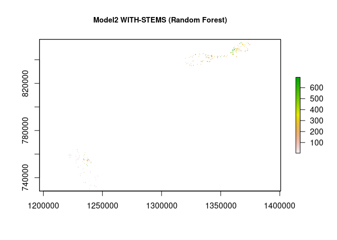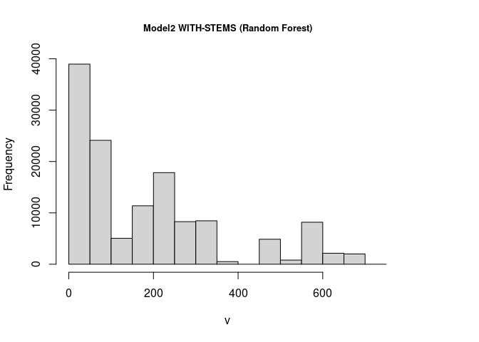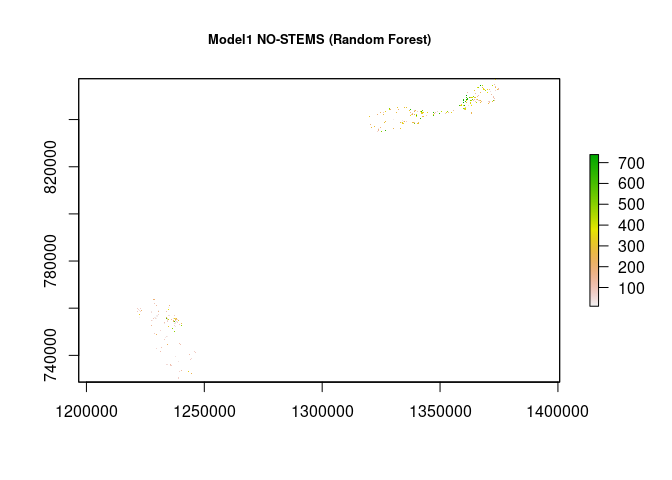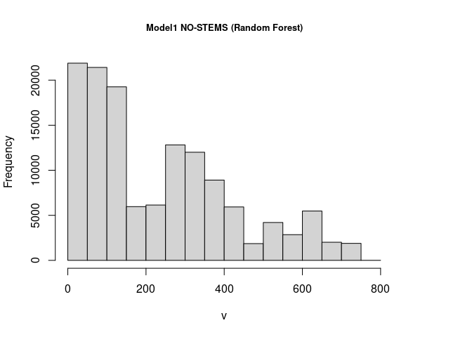
